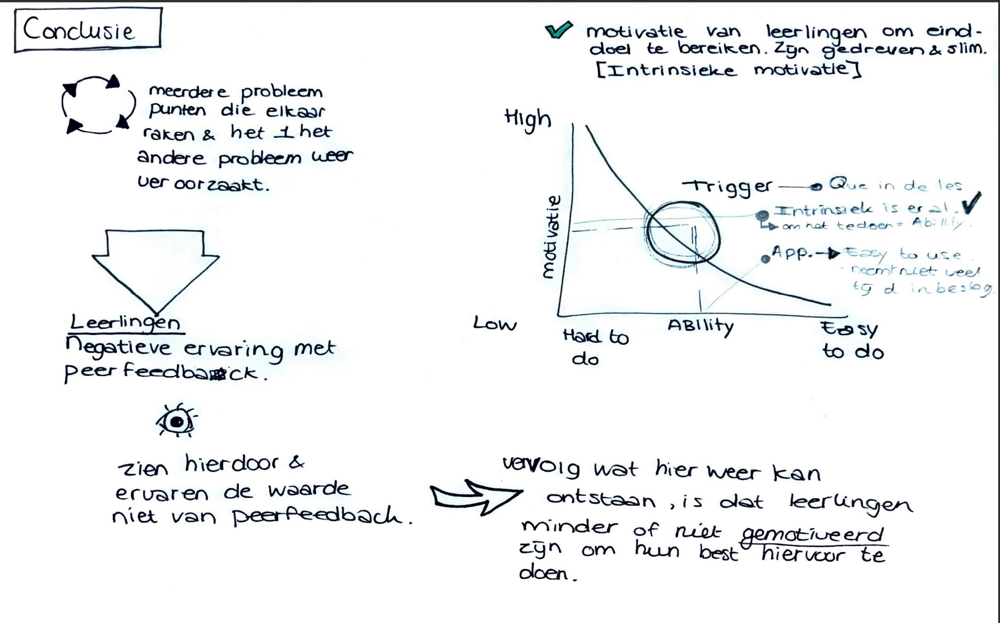

# Oorzaak en Gevolg Conclusie

Meerdere punten die naar voren kwamen uit mijn onderzoek bleken samen te hangen, die elkaar ondersteunden om het doel wat het Cartesius 2 met Peerfeedback wil behalen elke keer niet wordt behaald. Ik heb mij bij elk onderdeel de vraag waarom elke keer opnieuw gesteld. Dit deed ik om ervoor te zorgen, dat ik als onderzoeker goed kon begrijpen waarom bepaalde gebeurtenissen zicht plaatsvonden. Dit hielp mij ook erg om in de goede denkrichting te blijven. 

### Oorzaken

De belangrijkste en interessantste punten die uit mijn onderzoek naar voren zijn gekomen wat mogelijke de oorzaken kunnen dat feedback niet goed en inhoudelijk worden gegeven.

* Er is geen vaste structuur voor de leerlingen v.w.b. het uitwisselen van feedback.
  * Dit geldt voor zowel de verschillende wijzes van feedback uitwisselen.
    * Per docent
    * Per module
  * Ook varieert de tijd die de leerlingen hiervoor krijgen, dit kan bijv. 10 minuten zijn of 20 minuten.
  * Er zijn geen vaste momenten voor feedback.
* De beoordelingsrubric zorgt bij de leerlingen voor onduidelijkheid, omdat het per niveau verschilt welke vaardigheden er toegepast moeten worden en niet elke leerling dit begrijpt per niveau. 
* Leerlingen geven elkaar feedback, maar bepalen zelf op welk niveau zij per module worden beoordeeld. Dit bespreken zij van te voren met de docent. Vervolgens komt het wel eens voor dat leerlingen van verschillende niveaus elkaar beoordelen/feedback geven. 
* Grote klassen van 30 - 50 leerlingen, niet iedereen kent elkaar even goed.
* Sommige leerlingen geven aan dat zij bang zijn om iemand te kwetsen, doordat zij verbeterende feedback geven. Zelf merken zij ook dat wanneer iemand anders dit bij hen doet, zij zich niet begrepen voelen hoeveel tijd zij in iets hebben gestoken en hoe hard zij ervoor hebben gewerkt. 
* Er is niet 1 verzamel punt voor het verzamelen van de feedback voor zowel de leerlingen als de docenten, dit wordt digitaal en op papier gedaan. 

### Gevolgen

* Geen vaste structuur, zorgt er weer voor dat leerlingen gehaast feedback geven, omdat zij het te veel tijd vinden kosten en liever doorwerken aan hun eigen opdracht. Niet elke leerling geeft hierdoor serieus of inhoudelijke feedback. 
* De Beoordelingsrubric kan het beste worden ingezet wanneer iemand een bepaalde expertise heeft en meer beoordelend feedback kan geven. De leerlingen  weten niet hoe zij aan de hand van de rubric de ander het beste feedback kunnen geven, omdat zij lastig vinden om de rubric te vertalen naar de opdracht. Hierdoor wordt er geen goede of inhoudelijke feedback gegeven en vragen de leerlingen liever feedback aan de docent die wel beschikken over deze expertise.
* Leerlingen van verschillende beoordelingsniveaus elkaar feedback laten geven, zorgt voor wantrouwen onder de leerlingen. Omdat zij vinden dat iemand van een ander niveau zich niet bezig houdt of weet wat er van het andere niveau wordt verwacht. 
* Doordat de klas zo groot is en de leerlingen elkaar niet goed kennen, zijn zij sneller geneigd om altijd aan dezelfde personen peerfeedback te vragen, waarvan het vaak vrienden of vriendinnen zijn. 
* Leerlingen voelen zich onzeker om feedback te geven en willen de ander helpen door feedback te geven, maar willen ook aardig overkomen, waardoor er niet altijd inhoudelijk feedback wordt gegeven, om de ander "maar niet te hoeven kwetsen". 
* Doordat er geen vaste verzamelpunt is voor de feedback, is het ook niet op inhoud te controleren door de docenten en kan het hierdoor niet verbeterd worden door de leerlingen. 

## Conclusie

Doordat deze punten elkaar op meerdere vlakken herhalend kruisen, wordt alles continu herhaald en wordt het doel " met en van elkaar leren aan de hand van Peerfeedback" niet behaald. 

De belangrijkste bevinding is dat leerlingen een negatieve ervaring hebben het uitwisselen van peerfeedback.  De peerfeedback wordt minder inhoudelijk, waardoor het weinig waarde heeft voor de ontvanger. Doordat dit door o.a. de bovengenoemde punten, daalt de motivatie van de leerlingen om deze manier toe te willen passen om met en van elkaar te leren. 

