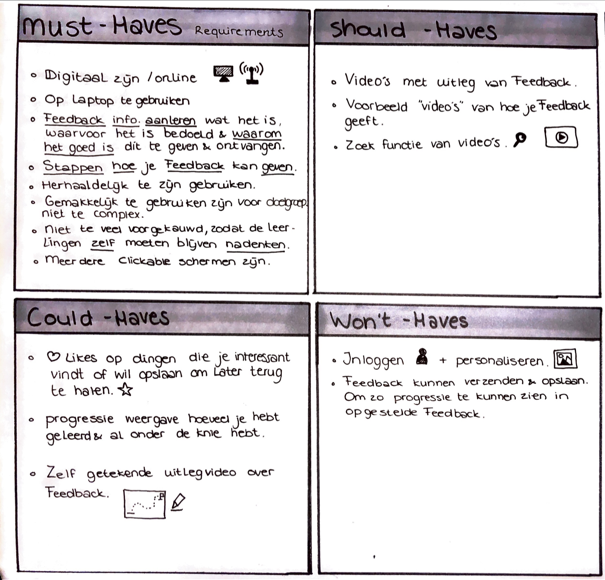

# Moscow Methode

Om een betere focus te krijgen heb ik voor mezelf een aantal punten opgeschreven waarvan ik vond dat deze het belangrijkste waren om te verwerken in mijn Applicatie, zodat deze functioneel goed werkt. Deze is tijdens het testen nog een aantal keer veranderd. Dit waren wat kleine aanpassingen, zoals bijv. het inloggen dat uiteindelijk tijdens het testen en dieper onderzoek, juist belangrijk bleek te zijn en een must have is geworden. 

#### 

#### Moscow Methode

[https://www.toolshero.nl/project-management/moscow-methode/](https://www.toolshero.nl/project-management/moscow-methode/)

