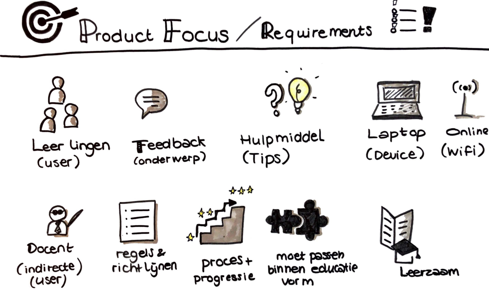

# Product focus

Deze focus punten moeten verwerkt worden in mijn Applicatie. Meer op resultaat of functioneel gebied. Bijv. het proces en maken van progressie is een uitkomst van goed Peerfeedback uitwisselen, maar wordt in mijn versie niet visueel uitgewerkt, gezien hier veel tijd voor nodig is om dit goed uit te werken. Ik heb dit wel meegenomen in mijn onderzoek en tijdens een co-creatie heb ik met de doelgroep gekeken naar het visualiseren van progressie. 

