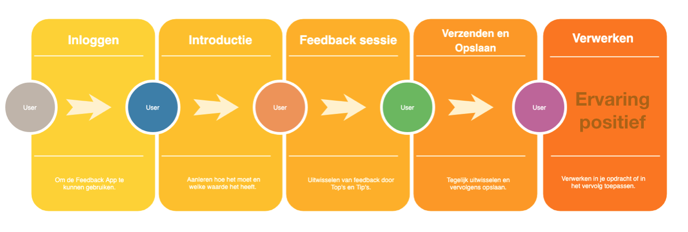

# Eindproduct

## Peer To Peer Web Applicatie

Dit concept begeleid de leerling in het uitwisselen van peerfeedback. Door leerlingen goed te begeleiden aan de hand van een tool die de docent inzet op een bepaald moment in de les, waarop de docent dit heeft ingeroosterd. Dit zorgt voor structuur en dat leerlingen allemaal tegelijk de tijd krijgen om feedback uit te wisselen, uit interviews was gebleken dat hierin nog geen structuur in was. Dit zou moeten voorkomen dat leerlingen gehaast feedback geven aan elkaar, omdat er en vast moment en tijd is ingeroosterd. 

Aan de hand van een introductie, door docent, worden de leerlingen geïntroduceerd met de App en op deze manier komen zij te weten waarvoor de App is bedoelt en hoe het in zijn algemeenheid werkt. Ook zou het door de introductie de leerlingen duidelijk moeten worden hoe waardevol peerfeedback kan zijn wanneer je dit goed geeft. Daarnaast wil ik met dit concept feedback uitwisselen leerzaam, aangenaam en makkelijker maken voor de leerlingen, zodat zij er meer plezier in krijgen en hierdoor een actievere houding aannemen. Dit doe ik doordat zij een profiel aanmaken en hierbij zelf een profiel kleur kunnen kiezen en een profiel foto kunnen toevoegen, om het persoonlijker te maken. 

