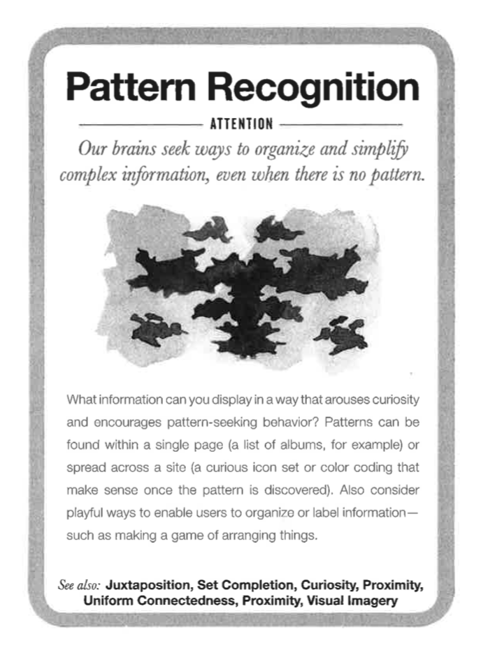
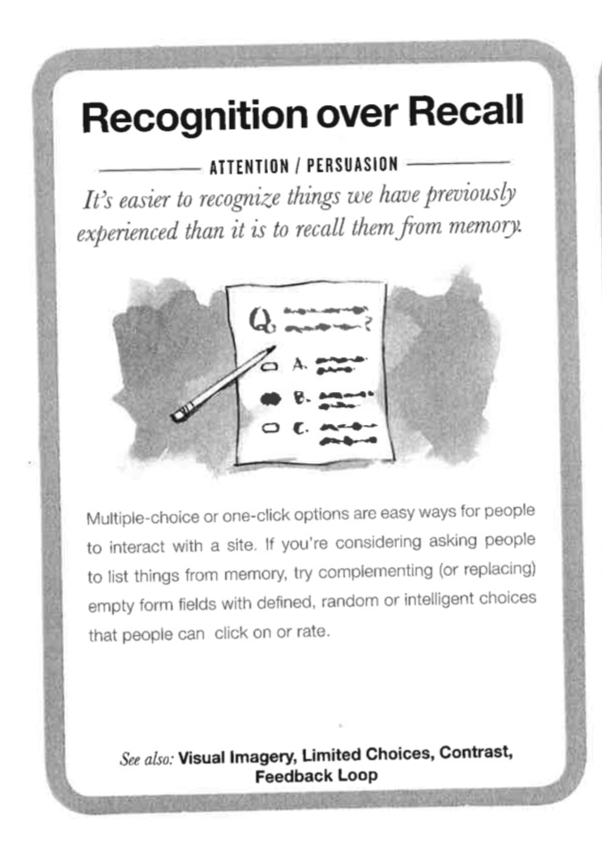

# Mental Notes Cards UX

_Met deze kaarten probeerde ik op sommige punten persuasion toe te passen._

* **Pattern Recognition**: om er voor te zorgen dat leerlingen niet te veel nieuwe dingen moeten leren, voordat zij de WebApp kunnen gebruiken. Dit geldt voor zowel de Usability als de Feedback vormen. Hierbij heb ik vooral rekening gehouden met het zoveel mogelijk toepassen van Google omgeving.
* **Self Expression:** Zowel men in het algemeen als de leerlingen vinden het belangrijk om zichzelf te kunnen uiten. Daarnaast wil ik dit ook toepassen bij het weergeven van hun progressie of gevoel dat zij hebben na het verwerken/lezen van de ontvangen feedback. Zodat zij bijv. aan de hand van sterren kunnen aangeven hoe nuttig de feedback was. Of dat zij zelf kunnen aangeven of en hoeveel progressie zij hebben gemaakt. 
* **Recognition over recall**: Belangrijk dat de leerlingen patronen herkennen en niet iets niets moeten leren of te veel moeten nadenken voordat zij tot actie komen. Dit zorgt ook voor consistentie binnen de oplossing, Applicatie.  \[Bron: [http://ui-patterns.com/patterns/Recognition-over-recall](http://ui-patterns.com/patterns/Recognition-over-recall)\]



