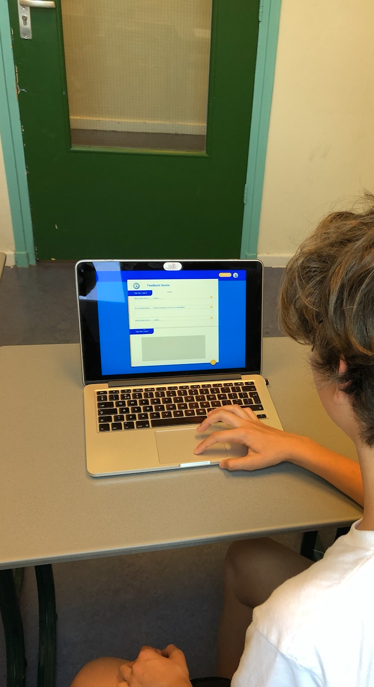
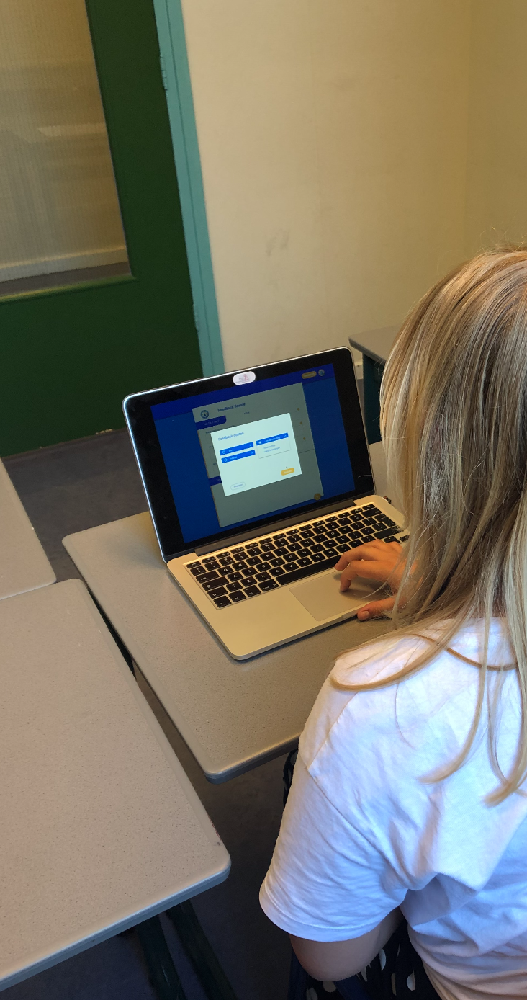

# Digitaal testen 2 x

Op 2 verschillende dagen heb ik de digitale prototype getest. Omdat ik mijn eerst test met een paper prototype had gedaan, was het vooral testen of de leerlingen de patterns herkennen e begrijpen wat er gebeurt. De testers heb ik een aantal kleine opdrachten gegeven binnen en pagina. Ik kreeg weer nieuwe inzichten en had deze meteen ter plekke aangepast.   
Uiteindelijk heb ik de laatste test uitgevoerd op 6 juni voor de laatste check. Gezien de leerlingen erg oplettend zijn en specifiek kunnen uitleggen, was het prettig dat zij ook kleinere foutjes eruit konden halen. Zoals bijv. in teksten. Daarnaast heb ik een laatste aanpassing gemaak en dat het toevoegen van blokken die ik in de laatste test heb veranderd in benaming "periode". Omdat dit een gebruikelijke term is op de school. 

