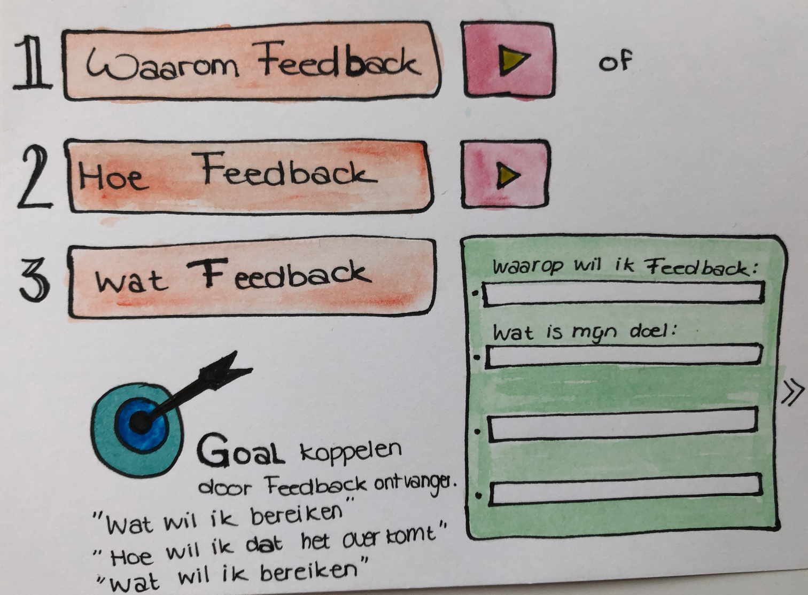

# Ideeën Ontwikkeling

In deze fase ben ik begonnen met het bedenken van verschillende oplossingen. Hiervoor heb ik op basis van mijn bevindingen en behoeftes vanuit de stakeholders verschillende idee ontwikkeld en heb ik hieruit uiteindelijk een soort combinatie idee gemaakt en deze ben ik verder gaan ontwikkelen tot mijn concept. 

## Schetsen Concept Ideeën 

### Metacognitief

Bij het bedenken van dit idee was ik nog in een algemene fase. Hierbij bedacht ik opbouwend een oplossing. Deze was meer gericht op de manier waarop het Cartesius 2 onderwijs geeft. Je kiest een onderwerp waarop je feedback wil geven en in stappen leer je hoe dit moet. 

Hoe werkt het ?

1. Je leert hoe je feedback moet onderbouwen, dit hoort bij stap **Aanleren**. 
2. Vervolgens ga je wat je hebt geleerd **toepassen**.  Je geeft feedback aan een leerling.
3. Nadat je dit hebt gedaan ga je het voor jezelf controleren hoe dit is gedaan door je zelf en wat je hebt ontvangen van de ander. 
4. Je reflecteerd op wat jij hebt geleerd en gedaan, zodat je kritisch naar jezelf leert kijken, na het gezien en geleerd hoe anderen dit hebben gedaan. 
5. Nadat je al deze stappen hebt genomen, rolt er een resultaat uit. \(progressie\).

Waarom ik niet gekozen heb om hier dieper op in te gaan, is omdat dit erg breed is en veel onderzoek nodig heeft om dit volledig en goed uit te werken. Helaas had ik hier tijdens mijn afstudeerproject niet de tijd voor, anders had ik mij hierin graag verder verdiept. 

## Peer to Peer chat en doelen

Bij dit concept was ik meer gericht op de doelen die de leerlingen van te voren zouden opstellen voordat zij feedback zouden verzamelen. Zij zouden aan de hand van een introductie video hulp krijgen bij het leren onderbouwen van feedback, waarbij zij meteen ook de waarden zouden leren inzien. Nadat zij doelen voor zichzelf zouden hebben opgesteld, zouden zij aan de hand van een soort chat met elkaar feedback uitwisselen. Wat een nadeel van dit idee was, is dat het vooraf aangeleerd wordt hoe leerlingen feedback moeten onderbouwen, maar dat dit niet terug komt in de app. 

## Peerfeedback Systeem

Hierbij had ik bedacht dat leerlingen echt met elkaar in gesprek zouden gaan. Dit Peerfeedback systeem was meer gebaseerd op communicatie. Waarbij leerlingen alsnog veel met elkaar moesten praten, en aan de hand van stappen leren een boodschap over te brengen en goed te onderbouwen. Maar omdat de docenten de feedback liever op papier hebben, was dit niet een goed idee, gezien het anders dubbel werk is om dit na het gesprek uit te moeten typen. 

