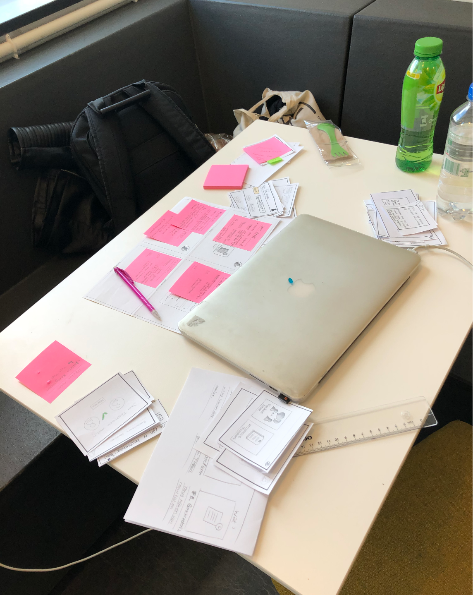

# Reflectie

Reflectie

Mijn afstudeer project is mij over het algemeen heel goed bevallen. Naast dat ik af en toe wat stuggles heb gehad. Aan het begin verliep het wat stroef en was het na 4 weken het moment aan mij om te beslissen of ik door moest en wilde gaat met dit project. Na veel te hebben gesproken met anderen heb ik besloten om door te gaan en even alle moed bij elkaar te rapen en gewoon naar de school te gaan en binnen te lopen zonder een afspraak te maken. Dit deed ik omdat het mij aan het begin was verteld dat dit gewoon mocht. Dit was even spannend, want ik had enkel een mailtje gestuurd met dat ik er aan kwam zonder dit te vragen of te bespreken. Dit pakte goed uit en sinds die dag verliep het contact veel soepeler. Ik heb voor mezelf die dag ook een docent aangesproken om te vragen of hij mijn contact persoon wilde zijn voor de komende weken, als een soort van begeleider.  
Sinds die dag kon ik goed an de slag en heb ik besproken wat ik wil doen voor wat betreft het onderzoek op de school. Ik merkte al gauw dat ik welkom was op de school en werd herkend naar mate ik daar vaker kwam. Het onderzoek doen naar deze doelgroep vond ik ook erg interessant. Ik had te maken met slimme kinderen en stond vak versteld van hun doordachte intelligente antwoorden, dat ik soms echt dacht “ dit moet ik even google”.  
 Daarnaast heb ik ook erg gemerkt dat ik het onderzoeken en verdiepen in bepaalde stof heel leuk en interessant vind. Vooral omdat ik mij erg op de gebruiker richtte, vond ik het ook erg belangrijk om hen er bij te betrekken, voor zowel mijn onderzoek als hun ideeën die ik er in wilde verwerken. Daarnaast vond ik het ook erg leuk om knelpunten te onderzoeken en deze proberen op te lossen. Hierdoor probeerde ik telkens verbanden te leggen en er aan de hand van bronnen achter te komen wat de **kern van het probleem was en niet enkel een oplossing te maken die alleen symptomen oplost**. Maar omdat ik niet veel meer tijd had voor dit stukje onderzoek, kon ik er niet veel dieper op ingaan dan ik had gewild.  
 Wat ik wel erg lastig vond is het maken van keuzes, omdat wij voor dit project maar een aantal weken hebben is het belangrijk om op schema te werken. Dat schema had ik dan ook wel gemaakt, maar was ik ergens in mijn chaotische laptop regelmatig kwijt. Wat mij wel erg hielp was dagelijks een to do lijstje maken en meer structuur brengen in mijn mappen van onderzoek etc. Hier besteedde ik dan soms net iets te veel tijd aan door het visueel aantrekkelijk te maken voor mezelf en verloor mezelf hier soms in. En omdat ik dit merkte paste ik dit toe op mijn idee ontwikkeling. Ik ben veel gaan tekenen en heb soms mijn informatie verwerkt in tekeningen of geschreven tekst, dit werkte voor mij heel goed. Iemand had mij een manier gegeven om sneller keuzes te leren maken in design, door binnen 3 seconden te kiezen wat ik ga doen en het dan ook te doen. Dit heeft mij ook erg geholpen in het digitale design proces.   
  
Dankzij dit project heb ik veel nieuwe kennis mogen opdoen. Ik vind het voor mezelf altijd erg prettig dat ik de gebruiker maar ook het bedrijf voor wie ik iets maak goed begrijp. Zo blijf ik zelf ook nadenken en begrijp ik wat ik aan het doen ben. Het is voor mij niet interessant wanneer ik alleen iets moet maken zonder ook gebruiker onderzoek te verrichten plus ook het probleem te onderzoeken. Doordat ik naar verschillende Meet-ups ben gegaan tijdens het afstuderen heb ik mogen ontdekken hoe anderen  te werk gaan met UX onderzoek. Hierdoor ben ik verder gaan leren kijken dan alleen de eerste resultaten van een onderzoek en ben ik meer gaan nadenken waarom er dingen gebeuren of ontstaan. Ik heb ook gemerkt aan mezelf dat ik mij op een professionele manier meer durf uit te spreken naar en vragen durf te stellen aan de opdrachtgever. Dit heb ik veel moeten doen, omdat ik alleen werkte dus ik werd op deze manier gedwongen. Aan het begin had ik hier meer moeite mee en kon het verschil tegen het einde van mijn project wel merken. 

Daarnaast weet ik nu zeker dat, ondanks het project mij veel tijd en energie kostte en ik hiervoor niet betaald werd, dat ik enorm veel plezier heb in UX research en UX design. Ik merk dat ik zelfstandig een project draaien dan ook erg leuk vind, maar ook zou ik zeker in een team willen werken, om zo veel te kunnen sparren met anderen. Plus ik houd wel van gezelschap tijdens werk.  

  
Wat kon beter

* De docenten en directeur regelmatiger en meer bij mijn project betrekken. Dat had beter gekund. Ik was nu vooral veel gericht op de leerlingen. 
* Had nog meer technisch onderzoek willen verrichten, maar doordat ik niet genoeg tijd hiervoor had heb ik dit minder gedaan. 
* Ik had graag nog microinteracties willen toevoegen in het design en dit in principle willen uitwerken. Hiervoor moet ik leren eerder knopen door te hakken, zodat ik meer tijd hiervoor heb. 

