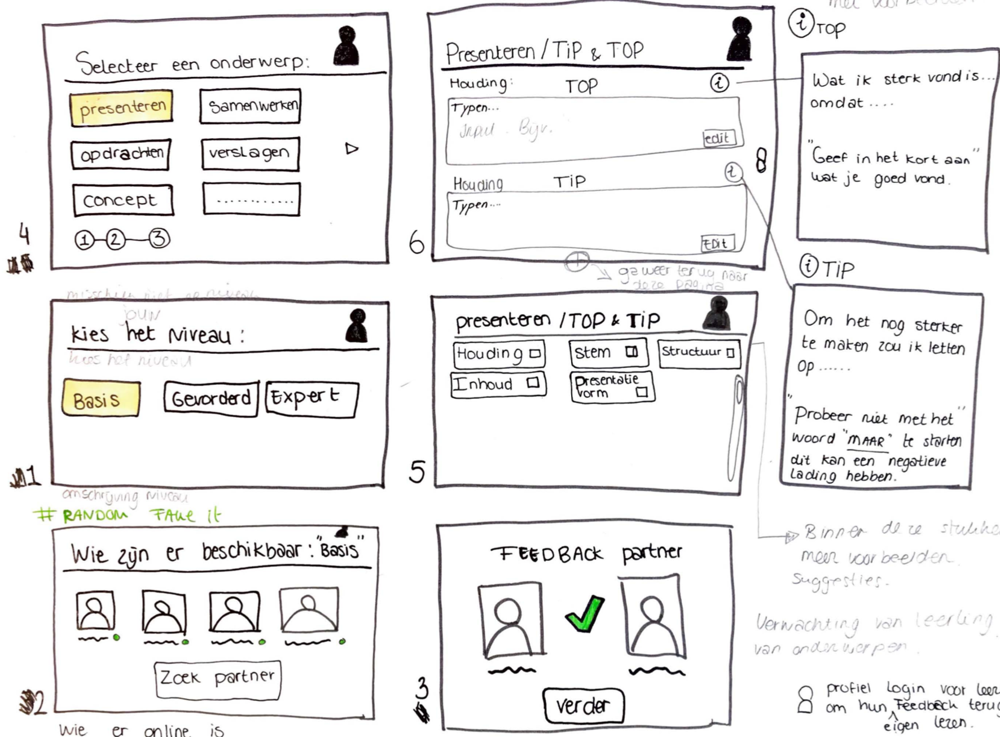
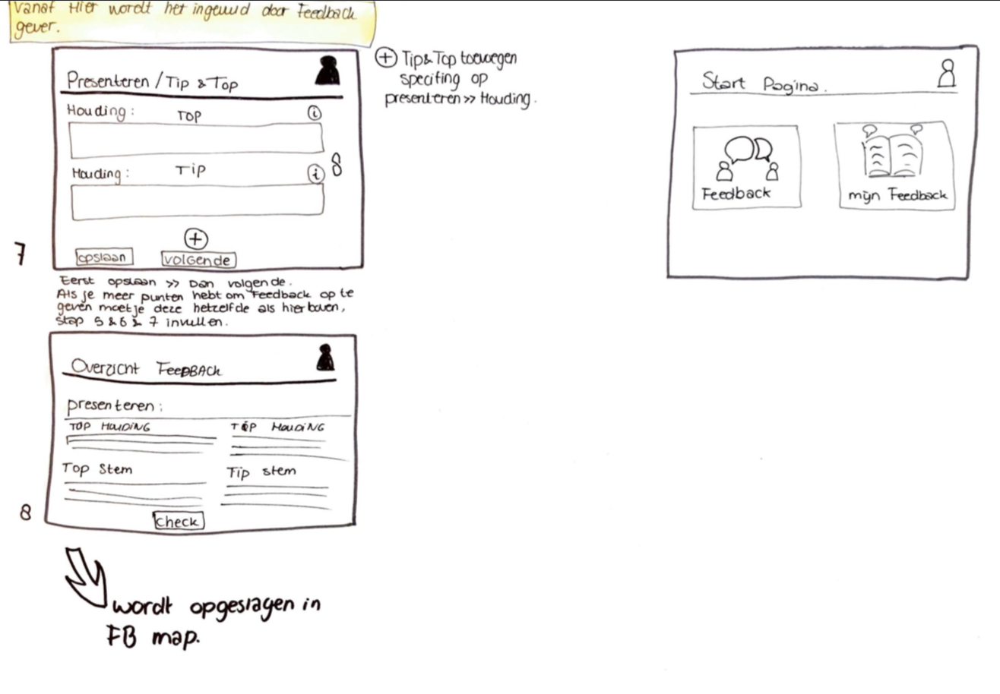
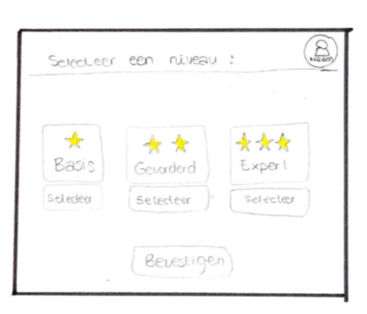

# Concept Iteraties 1

Hierin makte ik verschillende functies op verschillende schermen. Uiteindelijk heb ik er voor gekozen om op 1 pagina alle keuzes te maken. Op deze manier zorg je ervoor dat de gebruiker minder vaak hoeft te klikken naar de volgende pagina en in principe heeft de informatie de zelfde waar. In de zin van dat de informatie samenhangt met elkaar en aan het eind een eenheid vormt, op basis van module,  onderwerp en beoordelingsniveau. 

#### 

#### 

#### 

#### 

#### 

