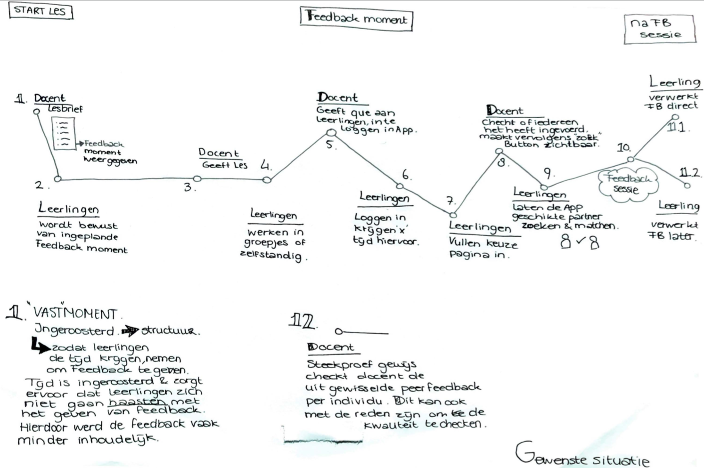

# User Journey

### **Stappen User Journey**

1. Leerlingen krijgen met de dag opening de lesbrief waarin staat wat er op de planning staat voor die dag. Leerlingen krijgen de keuze om te bepalen op welke onderdelen zij meer of minder aandacht willen besteden. 
2. De les begint en leerlingen krijgen de lesbrief en zien daarop staan dat er aan het einde van de les een gezamenlijk feedback moment staat ingepland voor de hele klas. 
3. De docent start de les en de leerlingen gaan aan de slag. 
4. Tegen het einde van de les geeft de docent aan, dat de leerlingen de feedback app moeten openen. 
5. De leerlingen krijgen 3 minuten de tijd om in te loggen en de eerste stappen te volgen om een feedback partner te zoeken. 
6. Op 1 moment wanneer de docent het aangeeft, zoekt de App een feedback partner \(docent klikt op button\).
7. Wanneer iedereen de geschikte partner aangewezen heeft gekregen kan de feedback sessie starten. Hiervoor krijgen de leerlingen ….. minuten voor. 
8. Wanneer de duo’s beiden de feedback hebben ingevuld en beiden op verzonden hebben gedrukt, ontvangen zij pas de gegeven feedback van elkaar. 
9. Deze feedback wordt opgeslagen in de feedback geschiedenis, zodat zij de feedback kunnen teruglezen en kunnen verwerken. 
10. Vervolgens sluiten de leerlingen de App af wanneer zij hiermee klaar zijn en gaan verder met de lesbrief. 

[https://medium.com/sketch-app-sources/user-journey-maps-or-user-flows-what-to-do-first-48e825e73aa8](https://medium.com/sketch-app-sources/user-journey-maps-or-user-flows-what-to-do-first-48e825e73aa8)

