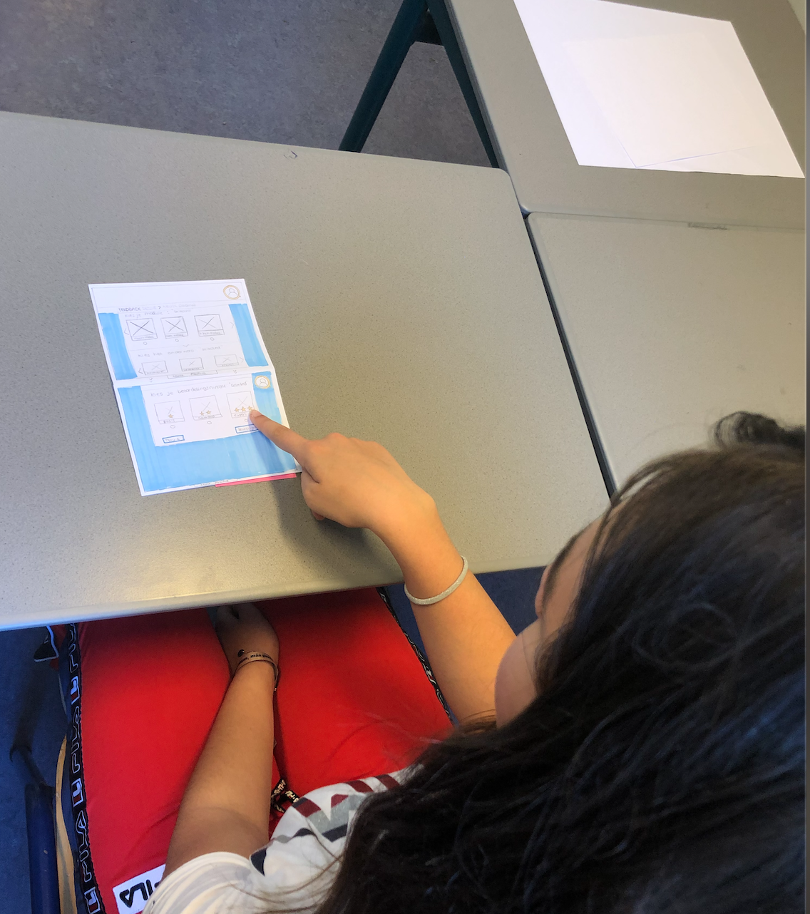

# Paperprototype test interactie

## Interactie Ontwerp

Omdat ik tijdens of tussendoor de lessen een aantal leerlingen kon vragen of zij de test wilden afleggen, heb ik 4 leerlingen laten testen. Dit heb ik met 2 verschillende paper prototype versies gedaan. De reden waarom ik voor paper prototype heb gekozen is:

1. Ik goed op de functionaliteit kan testen en de leerlingen visueel niet worden afgeleid. 
2. Ik per scherm 2 variaties had en deze kon wisselen om te vragen welke pagina's duidelijker of begrijpelijker is. Zo konden zij het ook vergelijken met elkaar. 
3. Tekenen mij wat makkelijker en sneller afgaat dan digitaal ontwerpen en ik makkelijker iets erbij kan tekenen wanneer leerlingen gebruikelijke feedback voor mij hebben. 

## Richtlijnen voor de test

* Profiel aanmaken pagina nog tips ?
* Voor elke pagina: Wat zie je en verwacht je wat het is en doet ?
* Wat zie je op deze pagina en wat verwacht je te zien waneer je op de knop drukt? 
* Start pagina &gt;&gt; 2 knoppen met sessie en geschiedenis.
* Volgorde van feedback sessie, hoe vind jij het handig ?
* Met welke volgorde starten van schermen. Niveau , Module, Onderwerp.
* Hoe vind jij het prettig om informatie/voorbeelden te zien hoe je tips en tops kunt geven ?
* Wat denk je dat \(+\) betekent ?
* Wat denk je dat er gebeurt of dat je krijgt te zien wanneer je hierop klikt ?
* Wat denk je dat \(i\) betekent ?
* Wat denk je dat er gebeurt of je krijgt te zien wanneer je hierop klikt ?



**Ochtend groep klas 2A 3 leerlingen 9 mei 2019**  
  
- Plaatje 1 Feedback sessie dat je kan praten met elkaar  
- Feedback geschiedenis wat je ziet heb ik alles verbeterd. 

  
Wat verwachten jullie als je op feedback sessie krijgt te zien.   
- Een gesprek met de leerlingen.   
- Als je het eenmaal weet wat de knop betekent dan is het wel duidelijk.   
  
Vraag van leerling: Moet ik het zelf aangeven op welk niveau of degene die feedback gaat geven ?   
  
Als je op een module klikt wat krijg je dan te zien ?  
Vragen misschien waar je op kan antwoorden, soort Classroom wat je krijgt.   
  
Per module krijg je verschillende onderdelen bijv. 3 eindopdrachten een verslag dagboeken video. soms ook alleen aan een eindopdracht. Je leert eerst de theorie, soort 1 project.   
In het echt stap je minder snel naar iemand toe. Als het niet het moment is, dan is er niemand.   
Per opdracht geef je eigenlijk aan op welk niveau.Alles op gevorderd.   
Heeft het tussen de 1000 woorden. sort vergelijken.   
Aankruisen wat je hebt gedaan per onderdeel. wat heb ik gedaan. Eerst met iets positiefs beginnen.   
Aantal woorden erin zetten, beginwoorden erin zetten. Dit zet je erin. Dat het er al staat. 

1. **Wat staat hier ?** 

* wat is een top
* misschien de feedback die je hier hebt gegeven. 

Mensen klikken denk ik dit nl op informatie knop. Het is wel handig maar misschien is het handig om het beiden te hebben maar ook in de tekst. VB. Hoe geef je een top ? Zie voorbeelden.   
Geef inhoudelijke feedback in de \(i\) als voorbeeld. Zodat leerlingen een voorbeeld kunnen zien.   
Degene die feedback geeft moet punten selecteren. 

  
**\(+\) Wat denk je dat dit is en wat er gebeurt wanneer je er op klikt ?**

* als je hierop klikt dat je extra opmerking krijgt.  Per vlak in top en tip in 1 vlak per tip per top.  Inklappen op uitklappen van Tip’s en Top’s bijv. houding en inhoud en niet 1 lange pagina. De vier onderdelen vouw je het uit en niet te lange teksten.  Dat het niet privé is is het wel goed. Zo was het namelijk een keer zo dat het feedback geven privé was, waardoor niemand het serieus nam en er gekke plaatjes werden gepost, waar niemand iets aan heeft.   Aan het einde kunnen invullen of je iets aan de feedback had. Weet ik nu wat ik moet doen. Dat de gever het kan zien. Feedback geven is wel een belangrijk onderdeel bij ons.  



**Toevoegingen van leerlingen aan mij.** 

Als je beiden op stop drukt bijv. dan dan wissel je de feedback pas uit. Je moet wachten op elkaar. Dus tegelijk en erop wachten. Om te voorkomen.   
Als de docent het heeft ingevuld, een goede houd is als je … doet.   
Het is handig dat je kan leren van elkaars verslag. Dat kan je bij de optie schrijven.   
Tegelijk feedback geven, dat het opent en je tegelijk op elkaar feedback geeft.  
Volgorde van invullen.Eerst de module &gt;&gt; dan opdracht en dan niveau. \(mensen werken eigenlijk altijd aan jezelf opdracht\)  
Dingen waarbij je moet nadenken welke keuze je maakt.







## Gebruikerstest vragen en antwoorden

In dit document \(UX:UITest.pdf\) had ik voor mezelf wat richtlijnen opgeschreven, om antwoorden te krijgen op mijn vragen. Wat ik erg leuk vond is, dat de leerlingen verbazend goede feedback voor mij hadden. Elke keer stond ik weer versteld hoe slim deze leerlingen zijn en dat zij ook erg nuttige feedback aan mij geven. Ook over punten waar ik zelf niet over had nagedacht. 



