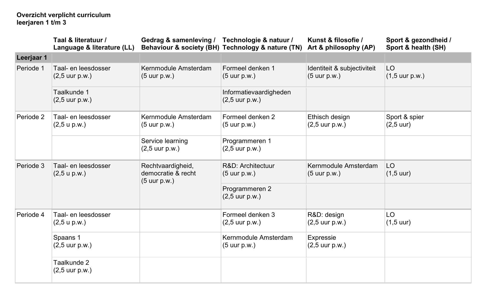
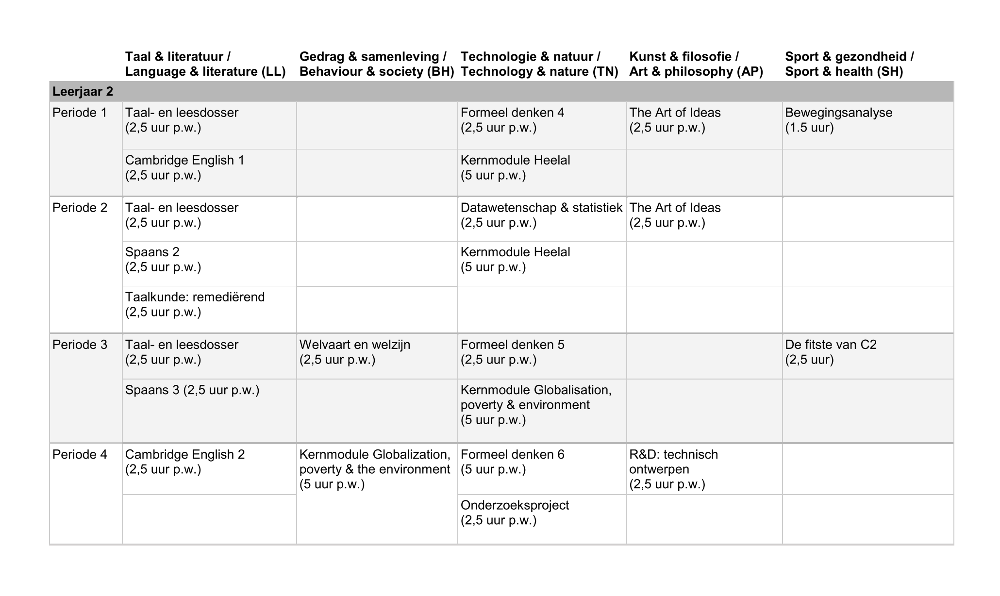
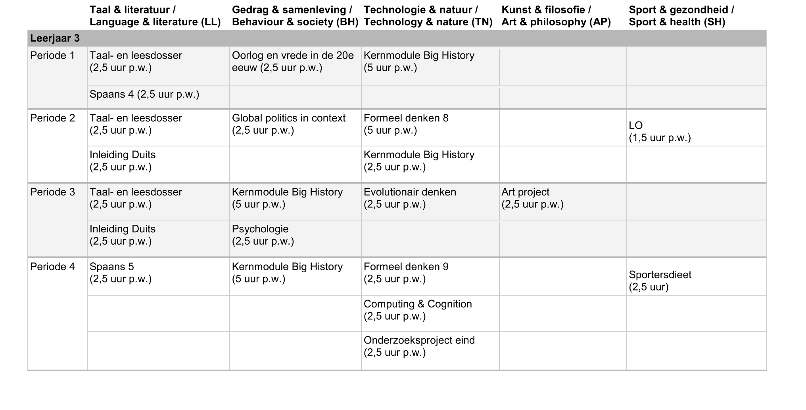

# Modules leerjaren 1,2,3

### **Overzicht modules** 

Er zijn nog maar 3 leerjaren, omdat het Cartesius 2 nog maar 3 jaar bestaat. In de screenshot zijn de verschillende modules per periode over een heel leerjaar weergegeven.  

Er worden leerdoelen gekoppeld aan de modules, die duidelijk maken wat de school wil dat de leerlingen zullen leren aan de hand van de modules. De leerdoelen zijn niet alleen het opdoen van kennis, maar wordt er ook gewerkt aan vaardigheden. Daarnaast maken leerlingen per modulen naar een eindopdracht met tussen opdrachten. 

[_https://c2.espritscholen.nl/home/onderwijs/curriculum/_](https://c2.espritscholen.nl/home/onderwijs/curriculum/)\_\_

