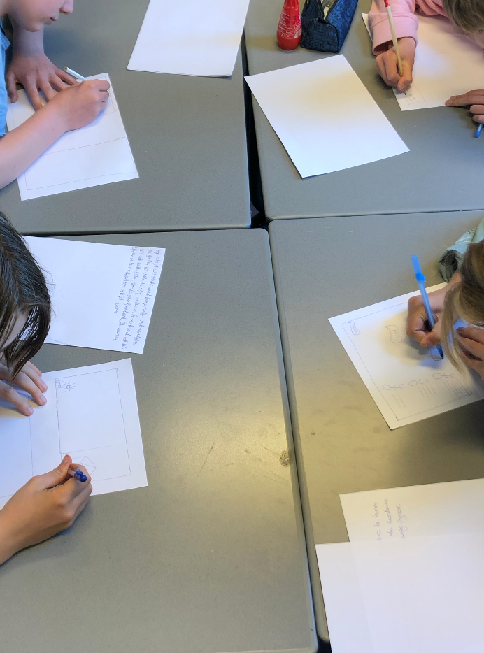
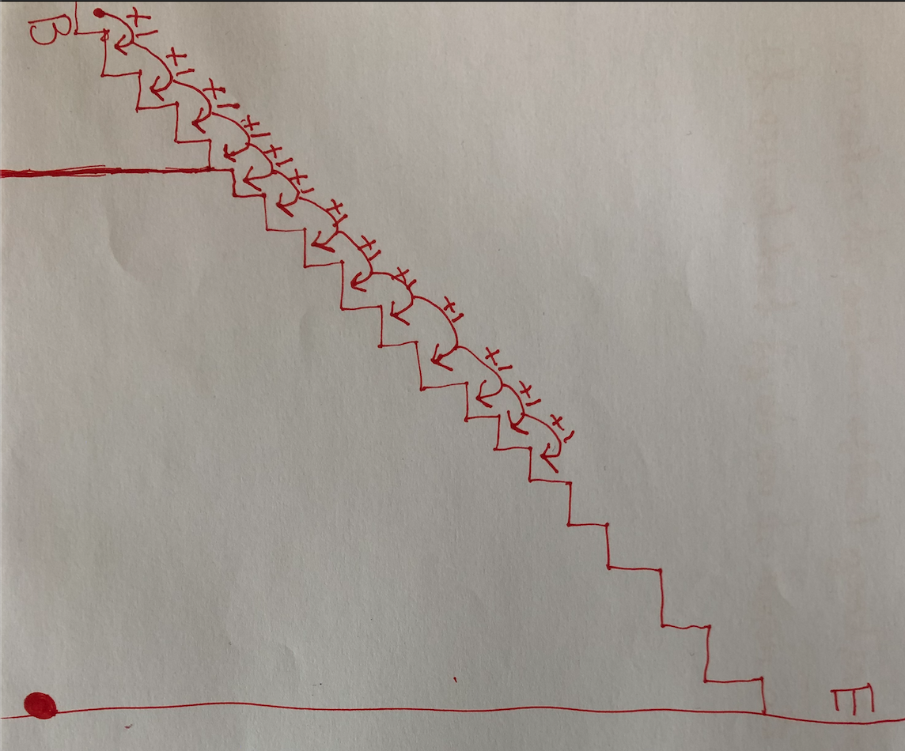
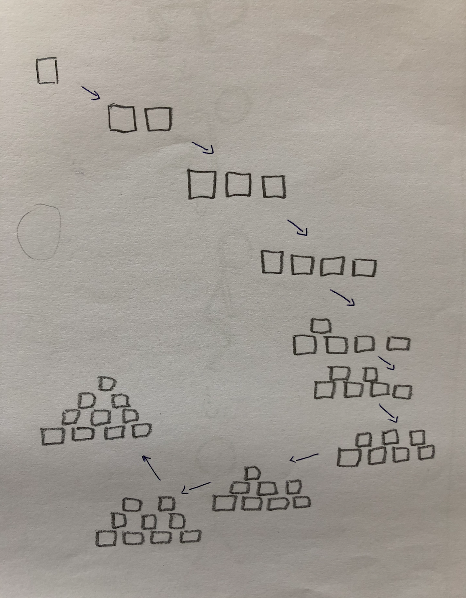
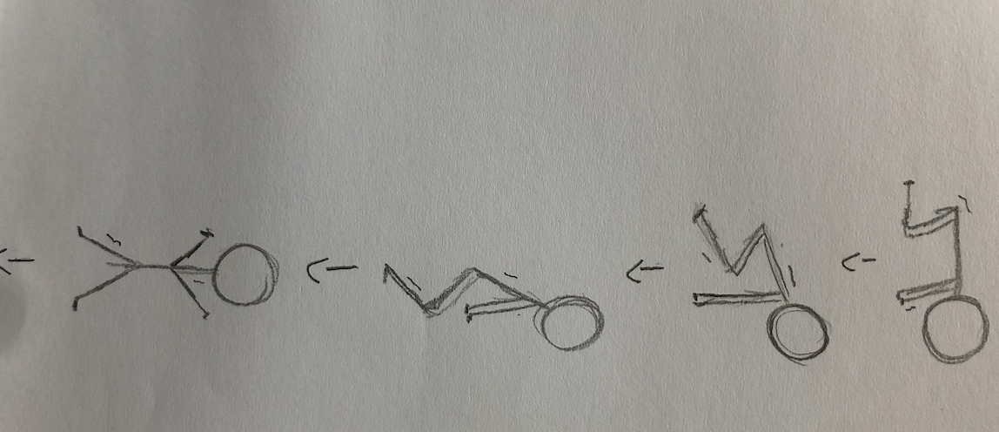
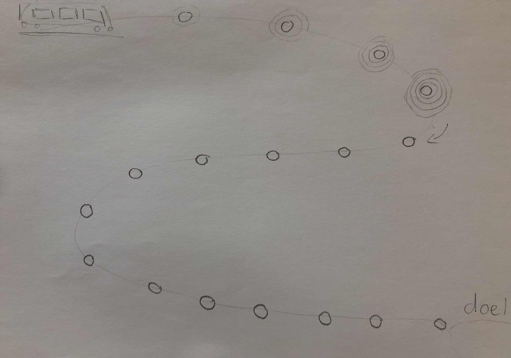
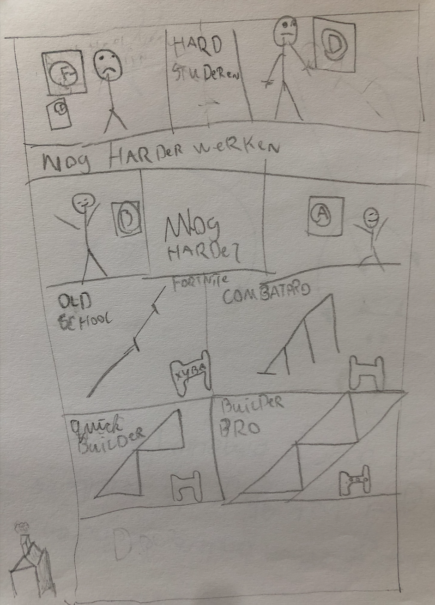
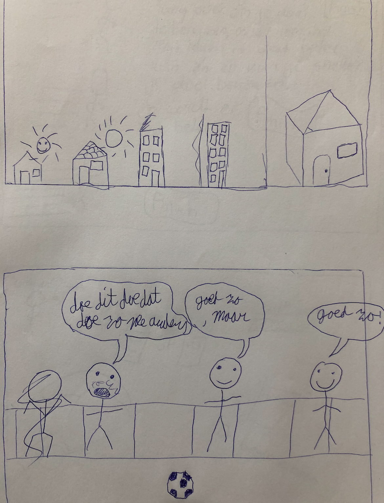
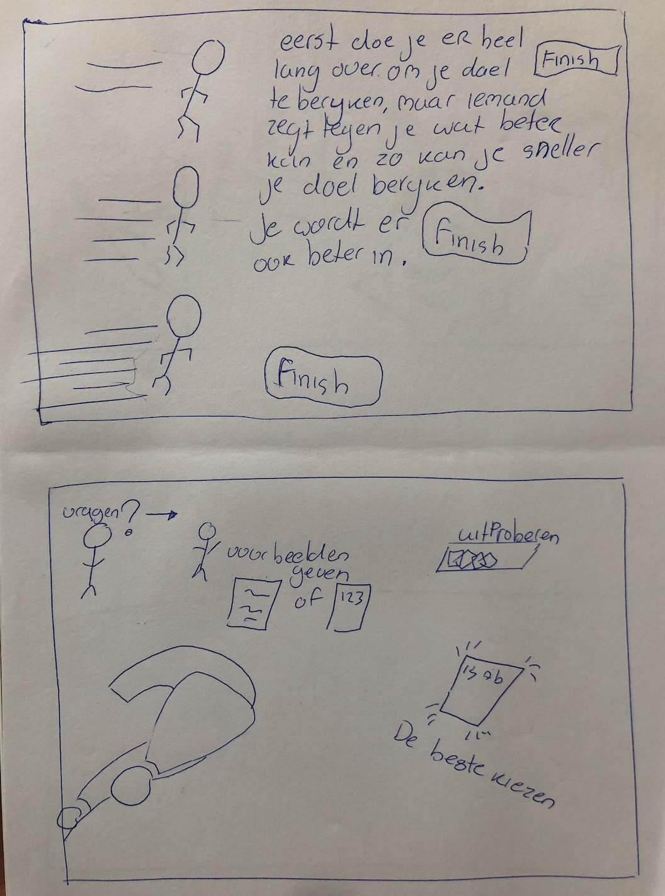
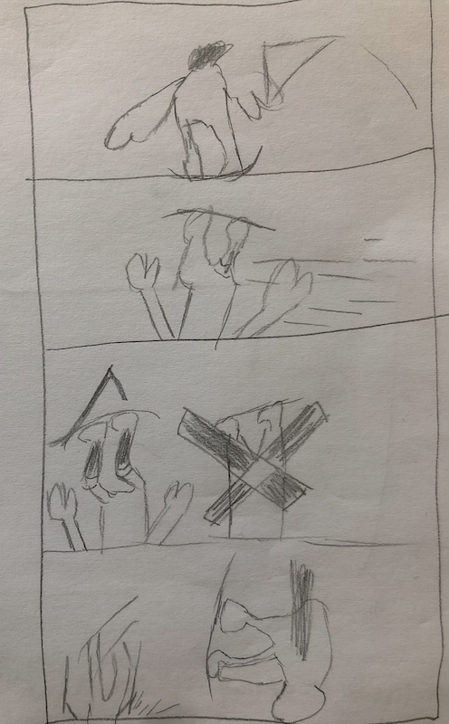

# Leerlingen Co-creatie

Wat ik tijdens de co-creatie heb gedaan is de leerlingen zelf een oplossing bedenken op progressie. Dit was een onderdeel dat ik wilde toevoegen aan de applicatie. Zodat zij aan de hand van progressie een soort zelf reflectie geven. Over hoe ver zij vooruit zijn gegaan met een vak bijv. De leerlingen heb ik zelf hun progressie laten visualiseren. 

