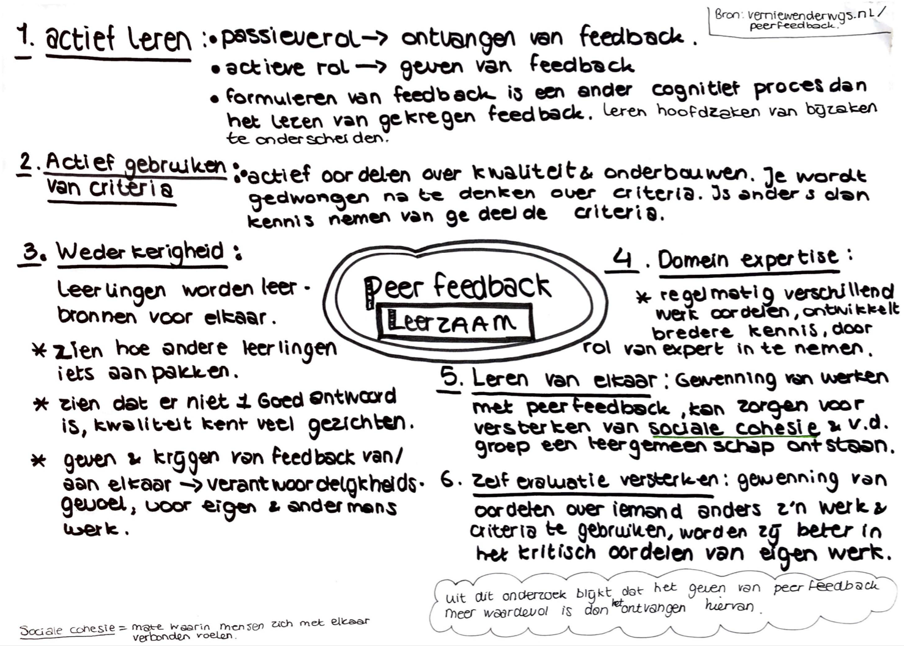

# Feedback onderzoek

### Van Dale definitie Feedback 

_“ De vergelijking is van het effect met de oorspronkelijke bedoeling”_

**Essentie van feedback**  
 _“Ons informatie geeft over hoe we het doen op weg naar het bereiken van een gesteld doel“_

**Verschil tussen Feedback, advies, beoordeling of compliment.** Feedback is not advice, praise or evaluation. It is not information about how we are doing in our efforts to reach a goal.   
\[Grant Wiggins, Am. pedagoog & auteur\]  
  
_“Elkaar aanspreken” kan een oordelende lading hebben. Eenrichtingsverkeer in de communicatie._

_Reflecterend vermogen_  
De vaardigheid om te kunnen reflecteren op het eigen handelen. Het in staat zijn om steeds in elke situatie het “eigen aandeel”, de “eigen verantwoordelijkheid” in beeld te kunnen nemen. De aanname hierbij is dat wanneer iemand dit niet kan, de feedback die hij of zij ontvangt, afketst als op een muur. Pas wanneer iemand de bereidheid en dat vermogen heeft, kan feedback “landen” en kunnen de vruchten ervan worden geplukt.

_Feedback is effectief als het antwoord geeft op de volgende 3 vragen:_  
\[1\] Waar ga ik heen ? \(Doel verhelderen\)   
\[2\] Hoe doe ik dat tot nu toe ? \(inzicht\)   
\[3\] Wat kan ik nog doen ? \(informatie geven aan de hand van punt 1 & 2\) \[Hattie & Timperley, 2019\]  

  
**Maak het proces van feedback geven effectiever. Hierbij gaat het om leraar naar leerling.**  
Voor leerlingen is het ontvangen van feedback een mogelijkheid om en kloof te dichten tussen de huidige status en de verlangende prestatieniveau. De informatie die je krijgt door feedback moet niet gezien worden als beloning, maar het moet ervoor zorgen dat er aanpassingen of afstellingen gedaan kunnen worden om dichterbij een doel te komen. 

Door feedback helpt iemand om verder na te denken, plannen, aan te passen of iets te heroverwegen en leert om uiteindelijk zelfstandig te werken op een realistische en afgewogen manier. 

> Daarbij wordt wel gezegd : “Feedback werkt omdat het doel bekend en helder geformuleerd is op basis van een realistische toetsing”. Toetsen zijn van vitaal belang in alle vormen van lesgeven en formele instructie.

Leerlingen willen vaak zo snel mogelijk resultaat zien en zien opdrachten zelf vaak iets waaraan docenten waarde aan hebben en niet zij zelf. 

Wanneer men leerlingen succes wil laten behalen van het gewenste niveau, is het belangrijk voor leerlingen dat zij verschillende manieren zien om succesvol te worden waaraan zij werken.  Bijv. door tussentijds voorbeelden te laten zien van verschillende niveaus en beoordelingen en de verschillen te bespreken.   
\[“Leren zichtbaar maken met de kennis over hoe wij leren”, J.Hattie & G.Yates, 2019\] 

### Peerfeedback

_A peer can provide an alternative stategy._  
****Dit is belangrijk voor wat betreft de feedback dat wordt gegeven onder de leerlingen op het C2 en welk doel de school heeft met het vragen en geven van feedback aan elkaar.

_Waar is peerfeedback goed voor ?_  
****Feedback vragen en feedback geven kan aan iedereen en wanneer jij het zou willen. Je kunt het toepassen op de werkvloer, op een samenwerking, maar ook op school. Ik ben mij daarom meer gaan richten op verschillende manieren van feedback vragen en geven van peer to peer. Dit is wat er in eerste instantie werd gevraagd aan mij om hier een oplossing op te bedenken. Gezien de leerlingen op het Cartesius 2 wordt gevraagd elkaar feedback te geven en samen en van elkaar te leren. Uit mijn onderzoek is gebleken dat peerfeedback daarbij kan helpen.

## Feedback bedrijven functioneren en/of beoordelingsgesprek 

#### Feedback geven, 10 gouden regels

Als je feedback geeft, bijvoorbeeld tijdens een funtionerings- of beoordelingsgesprek, houd dan de volgende 10 regels in gedachten:

1. **Feedback is specifiek en ‘to the point’.** Hoe specifieker je bent, hoe meer de ander ervan kan leren.
2. **Feedback is beschrijvend en heeft betrekking op gedragsaspecten.** Zeg niet rechtstreeks 'jij doet dit fout', maar beschrijf het effect van zijn gedrag. Bijvoorbeeld: 'jouw werkhouding zorgt er soms voor dat ...'.
3. **Beide partijen kunnen hun voordeel met de feedback doen.** Leef je in de situatie van de ander in en vraag jezelf af of jouw commentaar de ander kan helpen. Heeft hij er iets aan?
4. **Feedback is actueel.** Geef je feedback zo snel mogelijk. Wacht niet op een officieel gespreksmoment, als deze niet aanstaande is. Je kunt dan concreter zijn en de kans op herkenning is groter. Bij het functionerings- of beoordelingsgesprek kun je hier op terugkomen. Geef een compliment als het is opgelost. En zo niet: bespreek of beoordeel het punt.
5. **De ontvanger staat open voor de feedback.** Ga na of het wel het juiste moment is om feedback te geven. Probeer iemand onder vier ogen te spreken, op een rustig moment. Maar wacht er niet te lang mee. Zie regel 4.
6. **Wissel complimenteuze en corrigerende feedback met elkaar af.** Complimenten en [schouderklopjes](https://www.ondernemenmetpersoneel.nl/motiveren/10-schouderklopjes-voor-medewerkers) schieten er vaak bij in. Jammer, want zo laten we een kans liggen om de ander te motiveren.
7. **Beschrijf het gedrag dat je hebt waargenomen.** Geef concreet aan wat je hebt waargenomen, geef geen interpretaties. Het gaat om de concrete feiten.
8. **Vertel welk effect het gedrag van de ander op je heeft.** Als je ontevreden of boos bent, zeg het dan. Maak gebruik van ‘ik-boodschappen’ in plaats van ‘jij-boodschappen’.
9. **Ga na of de ander de feedback heeft begrepen.** Vraag er desnoods om met vragen als: ‘Herken je dat?’ of ‘Begrijp je wat ik bedoel?’
10. **Geef suggesties voor verandering van het gedrag.** Als je op een goede manier wilt corrigeren, bied dan een alternatief.

### Feedback formulier presentaties



#### 

### Feedback stappen op functioneren

chrome-extension://glcipcfhmopcgidicgdociohdoicpdfc/index.html

### Feedback Tip's en Top's

[https://www.desteven.nl/leerdoelen/persoonlijke-leerdoelen/feedbackvaardigheden-leerdoelen/feedback-tips-tops](https://www.desteven.nl/leerdoelen/persoonlijke-leerdoelen/feedbackvaardigheden-leerdoelen/feedback-tips-tops)

