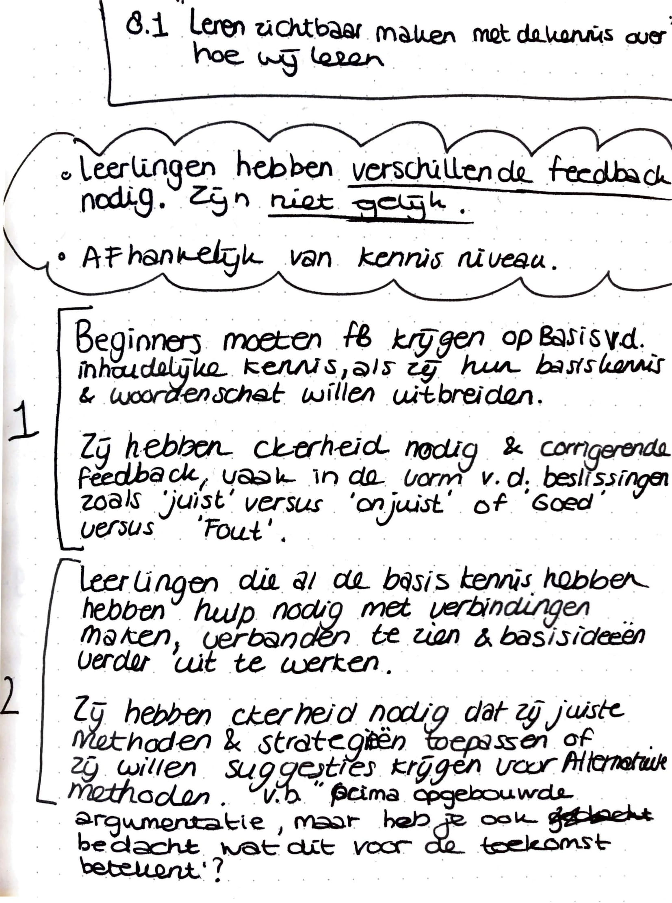
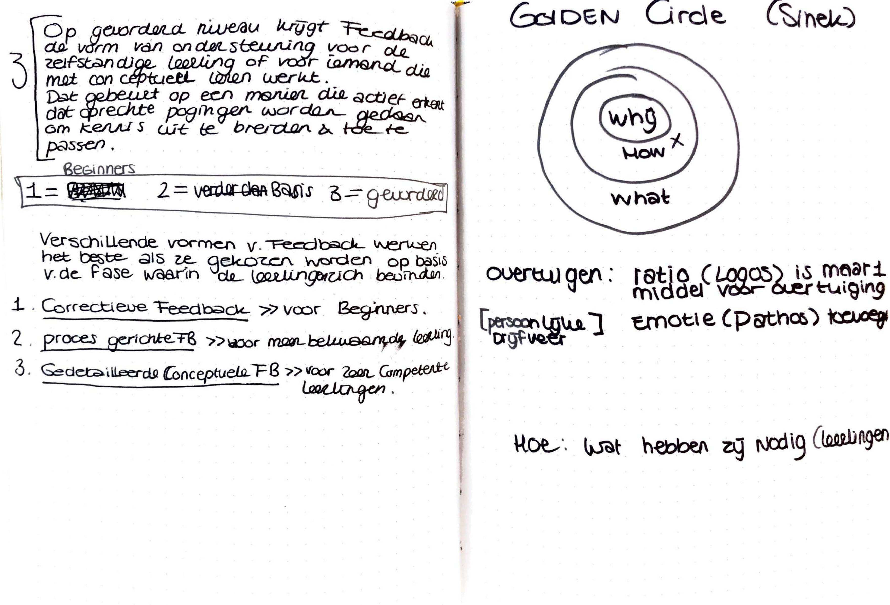
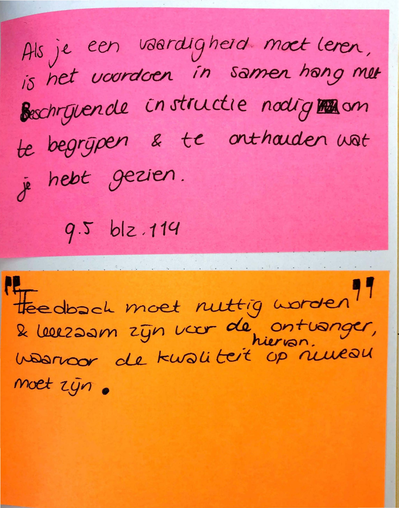
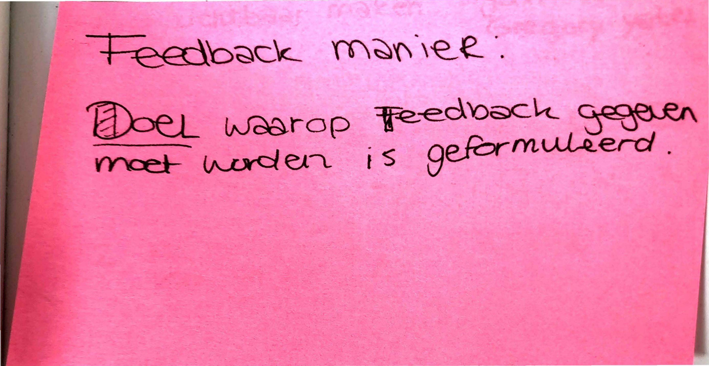
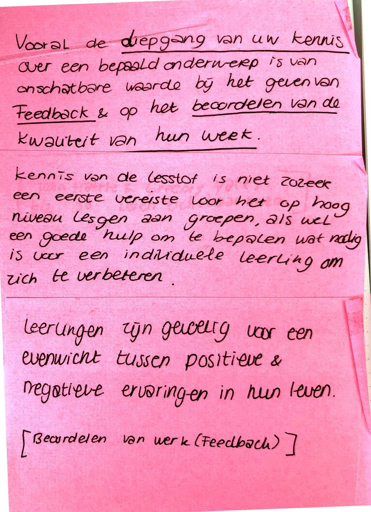
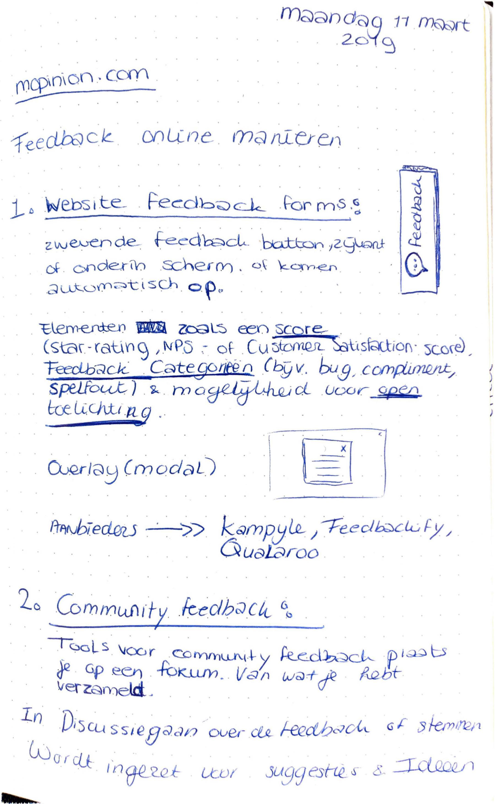
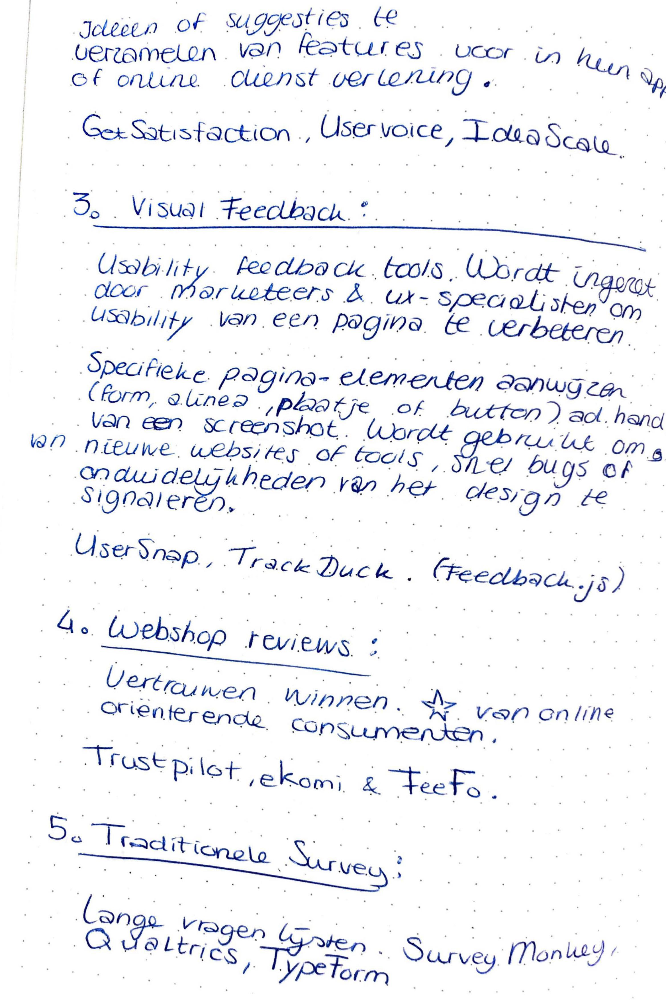

# Feedback onderzoek notities

Ik heb naar verschillende manieren van feedback geven en ontvangen onderzocht. Hiervoor heb ik mij verdiept in het geven van feedback in het onderwijs. Om er achter te komen welke manieren juist beter wel of beter niet toegepast kunnen worden. 

