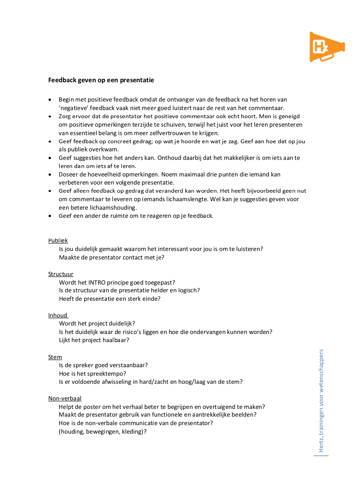

# Presenteren

Omdat het voor mij niet haalbaar is om alle onderdelen en alle modules onder de loep te nemen, heb ik er voor gekozen om mij om dit onderdeel wat meer uit te werken. Aan het begin nam ik alle stappen mee, hier heb ik ook over nagedacht maar uit eindelijk niet volledig uitgewerkt. 

Ik heb gekeken naar hoe er feedback gevraagd kan worden op presentaties, voor belangrijke richtlijnen die ik de leerlingen wil meegeven in de App. 



