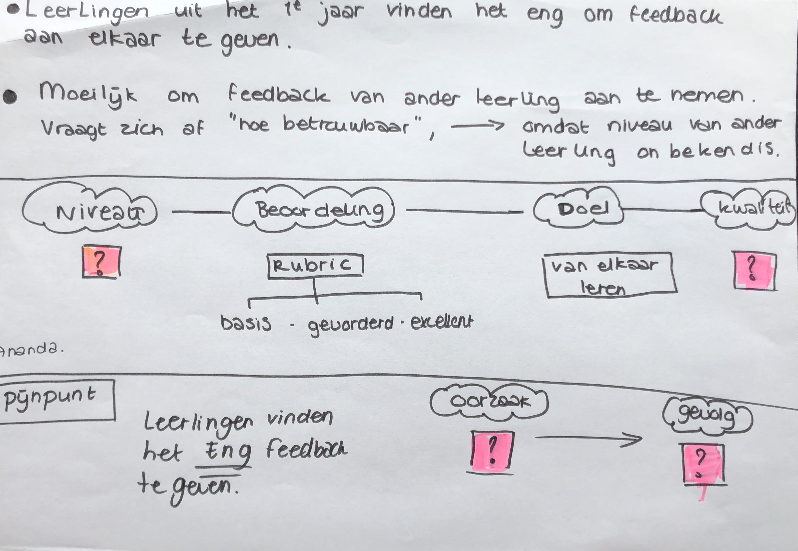
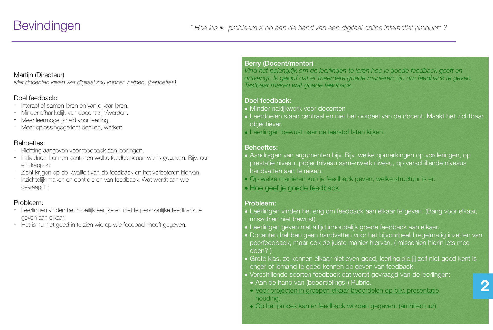

# Conclusie interviews

  
Na de informatie te hebben ontvangen en verwerkt heb ik even opgeschreven wat er precies gebeurt en waar de leerlingen volgens de docenten tegenaan lopen. Wat de belangrijkste doelen vanuit de school zijn en van de docenten en hoe je deze op de juiste manier zou kunnen bereiken. 

