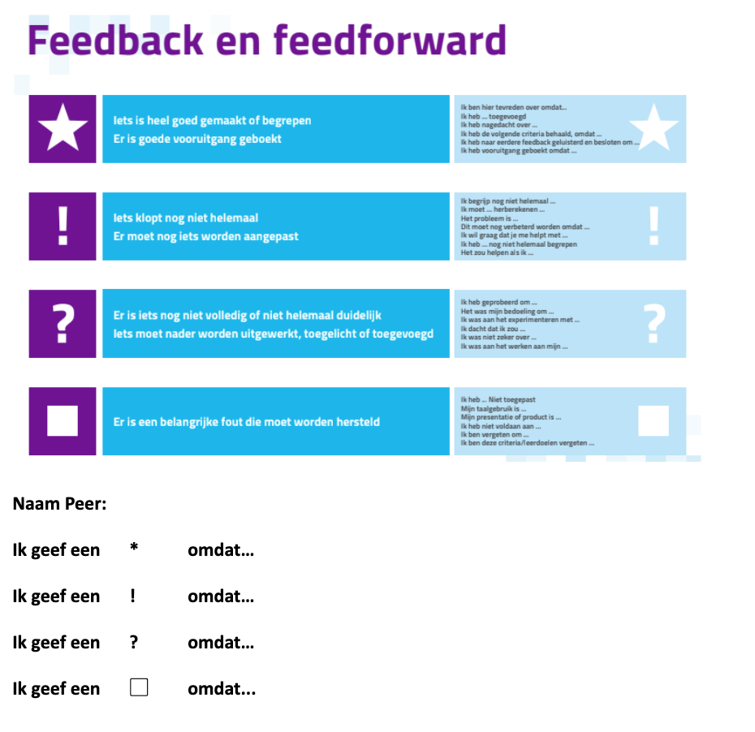

# Huidige Feedback methodes C2

Omdat ik hiervan meer wilde weten om het zo goed mogelijk te kunnen begrijpen heb ik hiervan een overzicht gemaakt. 

## **Manieren van Feedback op het Cartesius 2:**

* **Icons** met een bepaalde definitie \(dat door de docent is gegeven\) kan worden geplaatst op de plekken waarvan de leerlingen vinden dat er iets moet worden aangepast.
* Leerlingen krijgen een afvinklijst dat gebaseerd is op de **Rubric**, waarop staat wat er minimaal verwerkt moet zijn in de opdracht om de opdracht te halen. 
* Leerlingen schrijven de feedback op naast de tekening \(module voor kunst\).
* Leerlingen geven mondeling feedback op elkaar.
* Docenten geven feedback aan leerlingen, zij   maken markeringen in de opdracht, waarin staat wat de leerlingen moeten verbeteren om de opdracht beter te maken. 
* **Checklist** dat gebaseerd is op de rubric, waarin leerlingen alleen kunnen afvinken wat er wel of niet is verwerkt in de opdracht

## Rubric feedback

Dat is een beoordelingstabel waarin per niveau de beoordelingscriteria in staan, gebaseerd op Bloom. Leerlingen kunnen zelf bepalen op welk niveau zij uiteindelijk beoordeeld willen worden voor een module, dit gaat samen met de opdrachten en projecten die zij maken. Dit kan op **Basis niveau, Gevorderd of Expert.** Zij beoordelen elkaar op het aangegeven niveau, door te kijken naar wat er wordt gevraagd van hen en of dit in de opdracht is verwerkt.

|  | **Basis** | **Gevorderd** | **Expert** |
| :--- | :--- | :--- | :--- |
| **Vaardigheden** | Uitleggen en verklaren | Toepassen, analyseren vergelijken ook in andere context kunnen toepassen.  | Toepassen in bekende context, iets nieuws, bekritiseren, experimenteren.  |

**Doel rubric feedback**  
Verbeteren van de opdracht, door aan te geven wat er mist.

## Icons

De leerlingen plaatsen de icoontjes naast te stukken waarop zij iemand feedback geven. Daarnaast geven zij aan waarom zij dat icoontje hebben geplaatst naast een stuk. De feedback ontvanger gaat voor zichzelf dan na wat hij of zij nog moet aanpassen.

#### Plus punten:

* Kost niet veel tijd. 

## Checklist

De checklist is opgesteld door de docent. Deze wordt gemaakt in Google Forms, die word gedeeld en wordt ingevuld door de leerlingen. Deze lijst is te controleren, maar daarnaast geven de leerlingen elkaar mondeling feedback dat nergens wordt vast gelegd.

## Waarom al deze verschillende manieren van feedback op het C2 ?

* Omdat het onderwijs dat wordt gegeven op het C2 nog niet lang bestaat, zijn de docenten nog erg zoekende naar een goede manier, dit bleek uit de gesprekken. 
* Tijdsgebrek van docenten. Docenten hebben niet altijd veel tijd om iedereen feedback te geven. En laten het leerlingen aan elkaar geven. 
* Het per module verschilt hoe je ergens feedback ergens op kan geven, dus je kunt niet altijd dezelfde manier van feedback toepassen die de docenten tot nu toe hebben ontworpen. 

