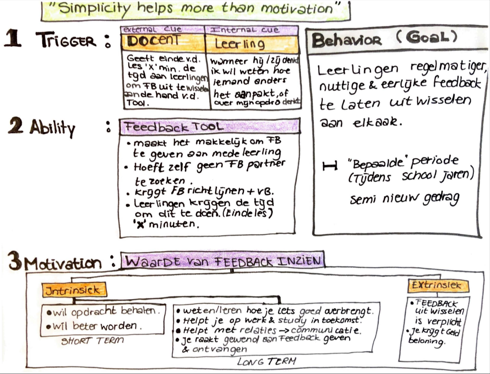
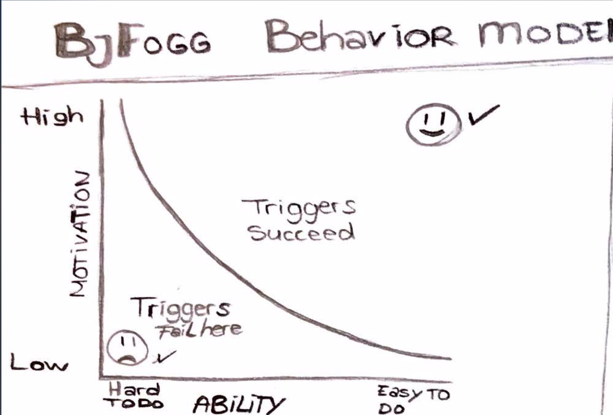

# Behavior Model - Bj Fogg

Ik ben met dit stuk onderzoek voor mijzelf gaan opschrijven welk doel "ik" wil bereiken aan de hand van mijn oplossing. Uiteraard moet dit aansluiten op de behoeftes en wensen van de stakeholders. Om alles beter in kaart te brengen kwam ik tot deze stap. Behavior model. Hierin was het voor mij handig om op te schrijven welke motivatie, ability en triggers er al waren of nodig zijn om het gewenste gedrag \(het doel\) te behalen.   
Deze 3 bovengenoemde punten moeten elkaar op het zelfde moment raken. 

### 

### Conslusie

Ik kwam er achter dat er in principe de middelen aanwezig waren. Alleen mistte er een onderdeel bij Ability. Het kostte vaak te veel tijd vonden de leerlingen, niet alle feedback methodes waren even duidelijk of nuttig naar hun mening etc. Hierdoor daalde de motivatie om peerfeedback uit te wisselen, waardoor het om weer om verschillende redenen inhoudelijk minder goed was. Om deze cirkel te doorbreken was het belangrijk om een aantal punten aan te pakken, die ik mee heb genomen in mijn product focus. Gezien ik niet alle tijd heb om alles te kunnen aanpakken. 

### Huidige situatie

**Trigger**: gaf de docent aan de leerlingen, door aan te geven dat zij niet moeten vergeten elkaar om feedback te vragen. Dit gebeurde dan wel op verschillende tijdstippen. 

**Ability**: Er waren verschillende feedback methodes die konden worden ingezet om feedback te vragen. 

**Motivation**: Leerlingen zijn gedreven en willen goed resultaat behalen. Op lange en korte termijn. Alleen willen leerlingen direct resultaat zien. 

### Gewenste situatie

**Trigger:** die kan beter worden ingezet als deze vanaf buiten wordt ingezet, door bijv. een vast moment in te roosteren voor de leerlingen. De trigger kan bij de leerlingen ook zelf opkomen, doordat zij nog vragen hebben bij hun opdrachten of e.d. waardoor zij getriggerd worden vanuit henzelf om vragen te stellen en feedback te vragen. 

**Ability**: Methodes zijn er, maar naar mijn mening te veel. Dit is ook niet heel gek omdat er verschillende modules zijn, waarop elke keer anders wordt beoordeeld. Maar vor structuur en duidelijkheid is het belangrijk voor de leerlingen om ook de juiste methode toe te passen is, en makkelijk te begrijpen en toe te passen is en naar hun mening niet te veel tijd kost. Dit hangt weer samen met het inroosteren van een vast moment. Het ligt naar mening mening, meer aan het gevoel dat leerlingen krijgen dat het te veel tijd kost en zij het liever besten aan hun eigen werk. En door er 1 vast moment met 1 vaste methode en middelen peerfeedback uit te wisselen, maak dit het al een stuk aangenamer voor de leerlingen.  Ook door voorbeelden en stappen te geven hoe je inhoudelijk goed feedback kunt geven. 

**Motivation**: De motivatie in de handeling zou hierdoor kunnen stijgen. De motivatie om goed resultaat te behalen en meer te leren is er al, deze hoeft enkel alleen gestimuleerd te worden door bijv. de ouders of docenten. 

[https://youtu.be/YQjLOyguXSQ](https://youtu.be/YQjLOyguXSQ)

