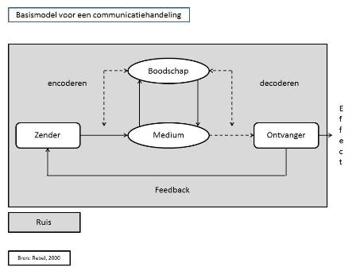
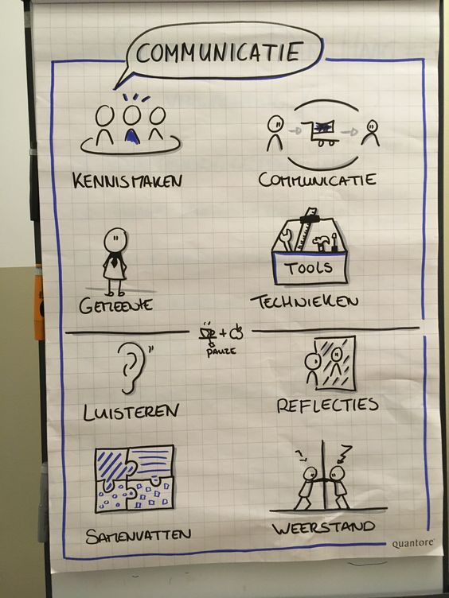

# Communicatie onderzoek bevindingen

> Het proces van zender naar ontvanger \(encyclo , 2019\)

Omdat communicatie erg belangrijk is bij het geven van feedback heb ik een aantal belangrijke punten onderzocht om dit mee te nemen in mijn oplossing. Ik vond het belangrijk om dit in mijn achterhoofd te houden. Je ben bezig met het overbrengen van feedback aan de hand van getypte tekst. Het is daarom belangrijk om te weten wat er kan gebeuren. In mijn geval kan er ruis ontstaan door een bugg in de app of slechte verbinding, waardoor er halve berichten kunnen worden verstuurd. Daarnaast moet ik ook rekening mee houden, dat het tekstueel wordt overgebracht, waardoor het juist belangrijk is om goed te letten op hoe je iets overbrengt. Het is ook goed voor de leerlingen om dit op de juiste manier aan te leren en te doen. Het is nl. belangrijk voor de leerlingen om te leren hoe je iets overbrengt en daarbij is het belangrijk dat de ontvanger de boodschap ook goed mag ontvangen.

Bron: [www.leernetwerkeducatie.nl](www.leernetwerkeducatie.nl)

Er worden in deze bron 7 tips gegeven hoe je communicatie vaardigheden kunt verbeteren.

**Tip 1: Luister  
Tip 2: Laat de ander uitpraten  
Tip 3: Hou oogcontact  
Tip 4: Let op non-verbale communicatie  
Tip 5: Beheers je toonhoogte en spreektempo  
Tip 6: Vraag door  
Tip 7: Vat samen**

\*\*\*\*

Bron: [https://www.fprtraining.nl/hoe-kan-je-je-communicatieve-vaardigheden-verbeteren-7-concrete-tips/](https://www.fprtraining.nl/hoe-kan-je-je-communicatieve-vaardigheden-verbeteren-7-concrete-tips/) \(Website,2019\)

\*\*\*\*

\*\*\*\*

\*\*\*\*

\*\*\*\*

\*\*\*\*



