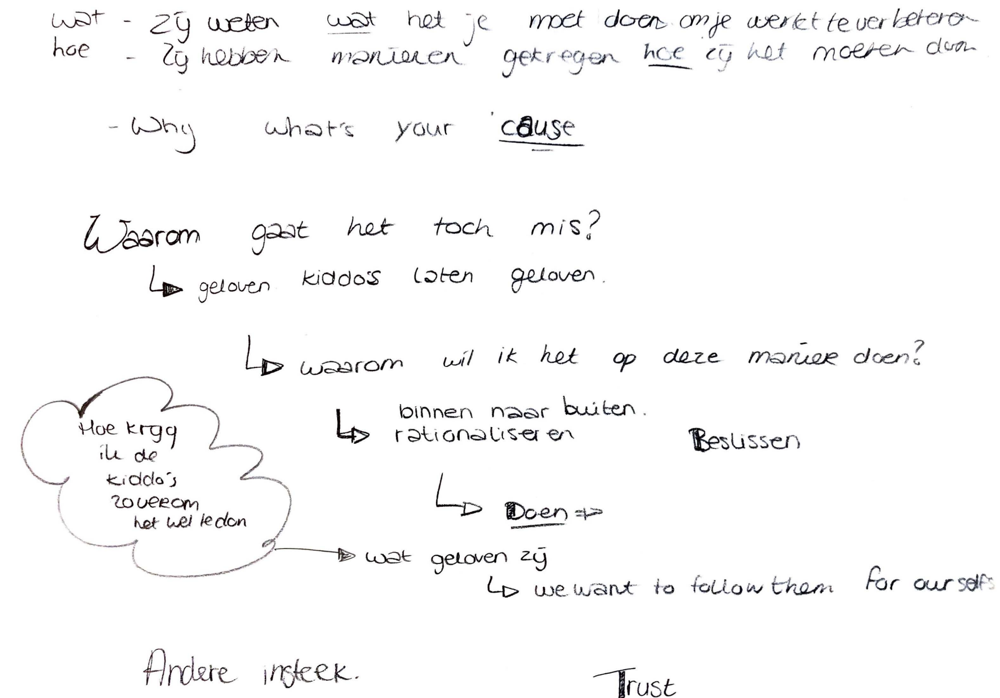
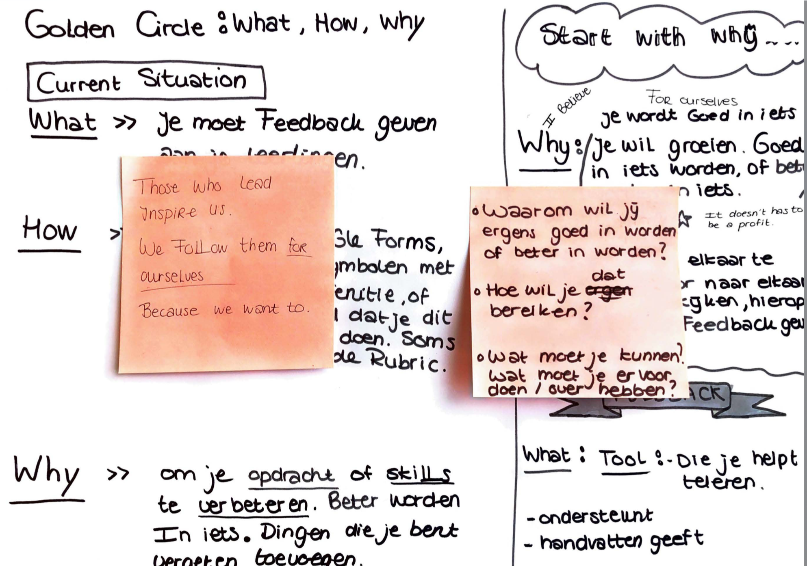

# Golden Circle Simon Sinek

Omdat ik tijdens mijn onderzoek bij de doelgroep mezelf heel vaak de vraag stelde, waarom is is dat zo? Waardoor komt dit ? Wat zou de oorzaak kunnen zijn ?

Een van de punten waarbij deze vraag bij mij opkwam, was toen de leerlingen hadden aangegeven te begrijpen wat feedback is, waarvoor het dient, welke voordelen je hierbij hebt door feedback uit te wisselen, ook gaven zij aan te weten hoe je dit moet doen, de docenten gaven de middelen etc. Maar toch kwam het vaak voor dat leerlingen het of niet deden, of snel feedback gaven, of een de ervaring hadden dat zij niet werden begrepen en dat feedback vaak wordt gezien als kritiek. En dit vond ik erg interessant, want de middelen hadden zij, zij wisten hoe het moest, welke voordelen je hieruit kon halen, maar toch deden zij het niet of niet op de juiste manier, waardoor de feedback vaak inhoudelijk zwak is. Ik ben mij daarom wat gaan verdiepen in waarom iemand iets wel zou doen of wel zou willen etc. Ik kwam hierdoor bij SIMON SINEK - The Golden Circle. Hierin vond ik dat er duidelijk werd uitgelegd met welke redenen men handelingen wel doen of juist niet, wat hiervoor nodig is etc. En dat het belangrijk is om uit te leggen en voorbeelden te laten zien, waarom is belangrijk is. Dat het niet wordt gezien als iets dat het bedrijf of de ontwikkelaar  alleen iets aan heeft, maar dat het de gebruiker een reden geeft waarom zij iets wel of niet zouden willen gebruik. En dit door jouw visie als ontwikkelaar of bedrijf naar voren te brengen. 

**Belangrijk**  
Waarbij ik tijdens mijn onderzoek achter kwam, is dat door meerdere probleem punten, leerlingen vaker een negatieve  ervaring hadden dan een positieve ervaring. Waarbij niet inhoudelijk feedback een grote rol speelt. Omdat de feedback inhoudelijk op laag niveau is, zien en ervaren leerlingen de waar niet van feedback. 

**Waarom ?**  
De reden uitleggen waarom je iets belangrijk of nuttig vind en waarvoor je het doet. 

**Hoe ?**  
Hoe bereik je dit ? Hoe pak je dit aan ?

**Wat ?**  
In mijn geval, welk resultaat levert het je op ?

### Aantekeningen







