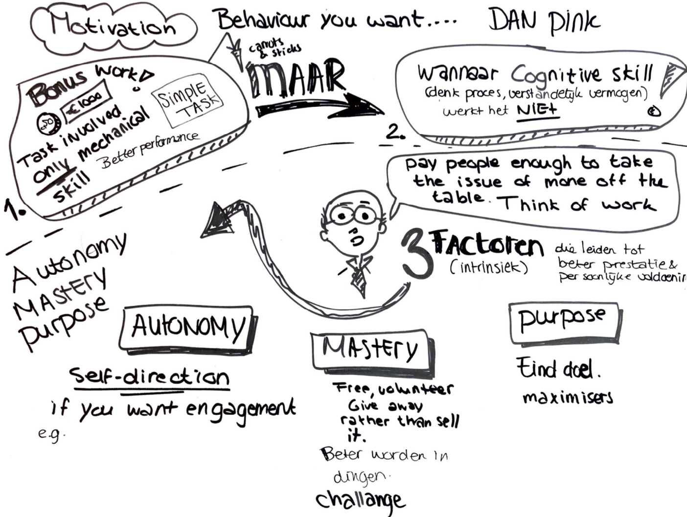
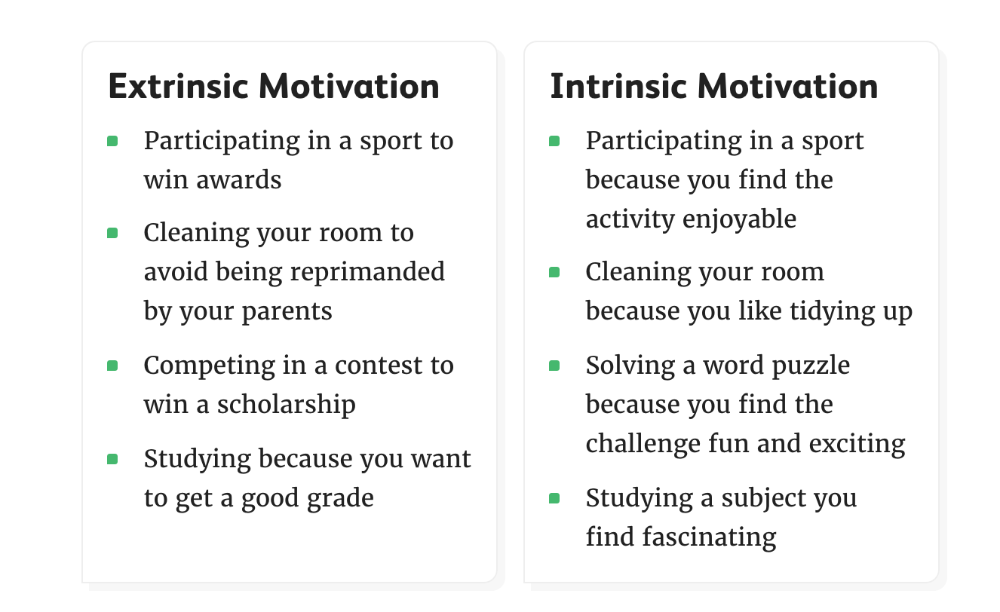
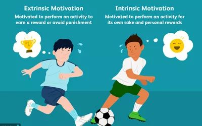

# Motivation

Het is belangrijk dat de doelgroep mijn product wil gebruiken en zal gebruiken. Niet alleen omdat de school het wil, maar omdat zij dit zelf willen, zodat zij het profijt van peerfeedback verschaffen zullen inzien en ervaren. Het is daarom belangrijk voor mij om te weten waar ik mij op kan en of moet focussen om er voor te zorgen dat leerlingen een meer positieve ervaring zullen hebben/krijgen bij peerfeedback. Hierbij speelt motivatie op verschillende vlakken een rol. Niet alleen bij het gebruik van mijn product, maar ook de weg ernaartoe tijdens en erna. 

Uit voorafgaand onderzoek \(gesprekken met de leerlingen\) is gebleken dat de leerlingen heel intelligent zijn en erg  gedreven zijn. Dit geeft al aan dat zij iets graag willen doen om ergens beter in te worden. Juist omdat de leerlingen gedreven zijn om veel te leren en het goed te doen, willen zij er zoveel mogelijk aan doen om een goed resultaat te behalen _\(Intrinsieke motivatie\)_. Wanneer er hen iets wordt gevraagd te doen vanuit de docent, wil het nog wel eens zo zijn dat zij dit niet graag willen doen, omdat dit meer aanvoelt als een verplichting _\(extrinsieke motivatie\)_.  



**Positief**

• Leerlingen zijn gemotiveerd. Dit bleek uit de observatieles, leerlingen letten goed op, stellen inhoudelijke vragen en werken goed aan de opdrachten tijden de les. • •Leerlingen zijn gemotiveerd om geen huiswerk mee naar huis te nemen, zodat zij na schooltijd klaar zijn en tijd hebben voor andere activiteiten. Zij werken daarom of in de les goed door of na de les, waar tot 16:30 uur de tijd voor is. 

**Negatief**

• Leerlingen zijn niet altijd even gemotiveerd om elkaar feedback  te geven. Dit heeft te maken met verschillende factoren. _\(zie Leerlingen enquête en Leerlingen Sessie post-it's voor oorzaken/knelpunten\)_  
 



• Positieve ervaring met feedback, waardoor zij gemotiveerd raken  elkaar feedback te willen geven.   
• Product moet niet te moeilijk/ingewikkeld zijn om te gebruiken, waardoor leerlingen een positieve ervaring hiermee kunnen hebben en dus ok gemotiveerd kunnen raken en het herhaaldelijk te willen gebruiken.    
• 



### Intrinsieke motivatie

Bij intrinsieke motivatie gaat het erom dat je van binnenuit al gemotiveerd wordt. Hierbij gaat het meer om de wil. Vanbinnen uit geprikkeld worden om bijv. een bepaalde taak uit te voeren. 

### Extrinsieke motivatie

Bij extrinsieke motivatie gaat het om van buitenaf gemotiveerd moeten worden om bijv. een bepaalde taak uit te voeren. Dit kan zijn omdat er bijv. een beloning kan staan tegenover het starten of afmaken van een bepaalde  taak. 

Bron: _Motivating, Influencing, and Persuading - Bj Fogg\*, Gregory Cuellar,    David Danielson, Standford Universaty.  \(Article, 2019\)_

_Bron:_[_https://www.verywellmind.com/differences-between-extrinsic-and-intrinsic-motivation-2795384_](https://www.verywellmind.com/differences-between-extrinsic-and-intrinsic-motivation-2795384)\_\_

Bron:[https://uxplanet.org/two-types-of-user-motivation-design-to-satisfy-aa9123668f62](https://uxplanet.org/two-types-of-user-motivation-design-to-satisfy-aa9123668f62)\(Website, 2019\)

