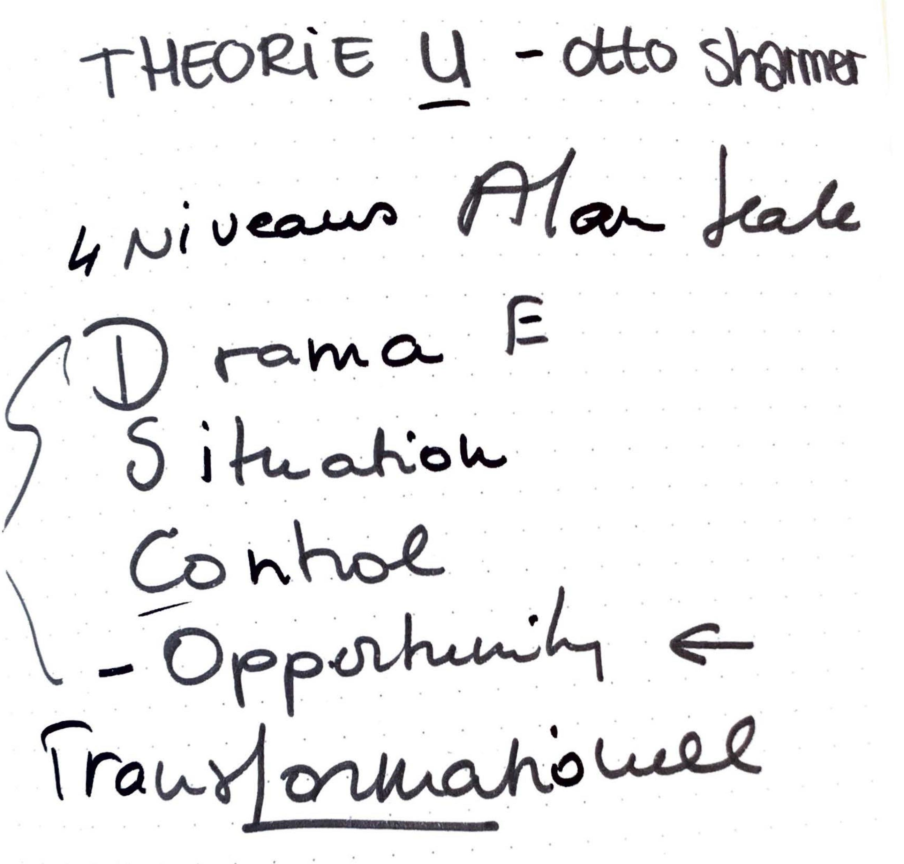
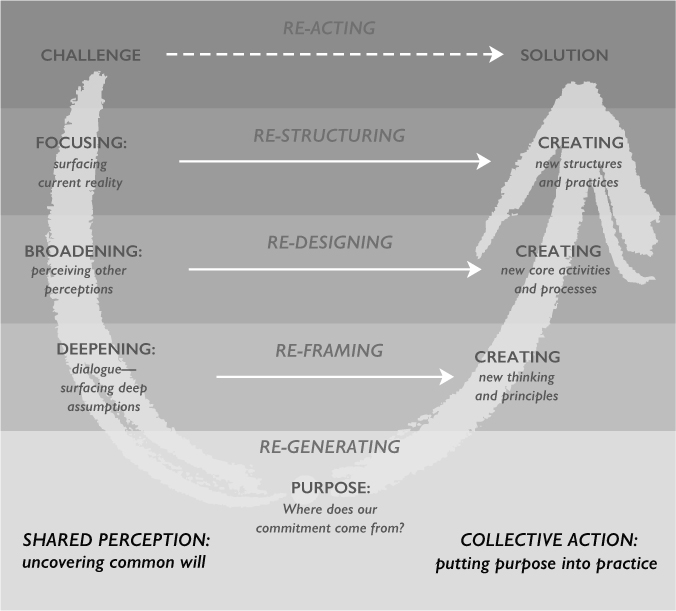

# U Theory

_Waarom is het belangrijk dat leerlingen peerfeedback geven aan elkaar?_

 Ik heb deze vraag nog eens aan mezelf gesteld, waarom het belangrijk is dat leerlingen aan elkaar peerfeedback geven en hoe dit het beste kan worden ingezet om het beste resultaat te behalen. Omdat ik dit helder wilde krijgen ben ik gaan kijken naar wat mij zou helpen bij het onderbouwen en chronologisch vertellen van het probleem tot de oplossing. Ik raakte per toeval in gesprek met een Coach die een theorie toepaste op problemen die moesten worden opgelost. Zij benoemde Theory U van Otto Sharmer dat uitleg geeft van je uitdaging/probleem tot oplossing en in welke fases je terecht komt en wat waar op reageert en of impact op heeft.

Bron: 



