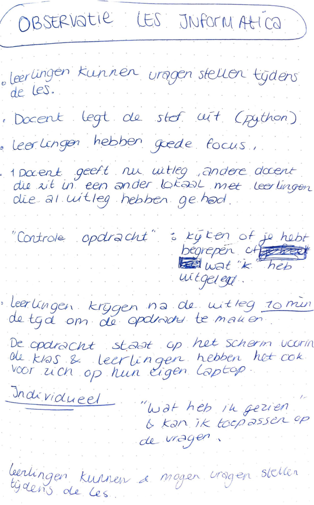

# Observatie Les

## Doel observeren

Op mijn eerste dag op het Cartesius 2 ben ik de leerlingen gaan observeren. Door alleen te kijken en luisteren, hoopte ik een beter beeld te krijgen van de school, manier van lesgeven, de opbouw van zo'n les, maar ook met wat voor een soort leerlingen ik te maken zou krijgen. Daarnaast probeer ik ook op bijzonderheden te letten. 

Door te observeren is het aan mij om zo goed mogelijk waar te nemen wat er gebeurt voor tijdens en na een les. Observeren is iets dat ik dagelijks doe en ook als iets leuks ervaar.

## Observatie les 1 Informatica \(python programmeertaal\) 

Ik ben achter in de klas gaan zitten zodat zij niet afgeleid konden raken door mijn aanwezigheid.   
Wat mij meteen opviel is dat zij kort even keken naar mij, wie ik was en wat ik kwam doen en omdat zij mij nog niet eerder hadden gezien. Toen de les begon waren zij eigenlijk meteen gefocust waren op de les. 

**Start 09:00** 

De dag begint met de lesbrief, hierin zien de leerlingen wat hen te wachten staat voor die dag. Zij kunnen hier aangeven war zij meer tijd aan willen besteden op die dag. Hier krijgen zij een half uur voor.  
  
**Les 09:30 - 12:00**  
Grote klas, met veel leerlingen. Een klas vol had wel zo'n 50 leerlingen. De les wordt gegeven door 2 docenten. 

De docent geeft eerst de instructies, de **leerlingen hebben** tijdens de uitleg een **goede focus tijdens de uitleg.** De leerlingen hebben de mogelijkheid om vragen te stellen aan de docent tijdens de uitleg. 

De docent geeft aan dat er een “controle opdracht” komt, zodat zij voor **zichzelf kunnen controleren** of zij de uitleg hebben begrepen wat er is uitgelegd. 

Vervolgens krijgen de leerlingen 10 minuten de tijd om individueel aan de slag te gaan. Een aantal werken in stilte zelfstandig en een aantal die kletsen. Zij worden er op gewezen stil aan de slag te gaan, maar dit gebeurt niet. 

De opdracht staat op een scherm vorig de klas, maar ook hebben de leerlingen de opdracht voor zich op hun eigen laptop. 

Veel wordt er klassikaal besproken en samen gewerkt in de klas, docent is interactief met leerlingen in de klas. Loopt rondjes en kijkt of de leerlingen goed aan de slag zijn. Wanneer een van de leerlingen om hulp vraagt neemt de docent de tijd om de vraag te beantwoorden.

Het zelfstandig werken gaat er nogal wat rumoerig aan toe.   
De groep is opgesplitst in 2 groepen. Een andere groep is aan de slag gegaan omdat zij de uitleg al hebben gekregen. 

### Opbouw les

Uitleg &gt;&gt; uitwerkingsopdracht \(individueel 10 minuten\)  &gt;&gt; nieuwe/andere uitleg &gt;&gt; nieuwe uitwerkingsopdracht \(individueel 10 minuten\)

Voorbereiding op andere lessen, zoals bijv. data analyse. Statistiek. Data visualisatie. Dit wordt in andere leerjaren gegeven. 

Leerlingen krijgen een pauze van 10-15 minuten. Zij krijgen de vrijheid om te doen wat zij willen, naar buiten, in de klas blijven of naar de gang om even iets te eten. Laptop en telefoon moet in het lokaal blijven. Buiten het lokaal mag er gegeten worden. \(ik ondertussen, zonder het te weten lopen eten in het lokaal\).   
  
In de pauze komen de leerlingen los en zijn ze best druk en wordt er ook door de klas en de gang wat gestoeid en gerend. Heel druk. Wanneer de les weer begint zijn de leerlingen uitgeraasd. Ik begrijp ook wel dat dit gebeurt, 1 les duurt 2,5 uur. 

Aan het einde van de les maken de leerlingen een toets, die zij vervolgens moeten inleveren wanneer zij klaar zijn. Vervolgens vullen zij de lesbrief in na het maken van de toets. Die zij vervolgens ook weer inleveren. 

In deze les is er niet tussendoor gebruik gemaakt van peerfeedback. Wel hebben de leerlingen tussendoor met elkaar de opdracht kunnen bespreken, de opgaves die zij opkregen tijdens de les. Zo maakten zij gezamenlijk de opdrachten. 

Na de les komen alle leerlingen weer samen in 1 lokaal, dus ook de andere leerlingen.  

### **Module Informatica**

De leerlingen kregen 2,5 uur les in programmeren. Zij leerden de basisvaardigheden van de programmeertaal Python. Ik nam achterin de klas plaats. Het leek er voor mij op dat dit een vervolg les was en de leerlingen al eerder wat hebben geleerd. Zij kregen eerst theorie uitleg, dit duurde ongeveer 20 tot 30 minuten, hierna kregen de leerlingen de opdracht om individueel aan de slag te gaan voor 15 minuten. Na de 15 minuten kregen de leerlingen weer wat uitleg van 20 minuten en mochten vervolgend weer individueel aan de slag voor 15 minuten. Vervolgen werd er een pauze ingelast. Na de pauze volgde er een korte uitleg en daarna mochten de leerlingen samenwerken als zij dit wilden. Opvallend voor mij was dat de leerlingen zich goed konden concentreren tijdens de uitleg. Hierbij werd vrijwel niet gekletst onderling. Er werd alleen gepraat wanneer zij iets te vragen hadden. De leerlingen kregen hiervoor ook de mogelijkheid om zo veel vragen te stellen als zij wilden.

