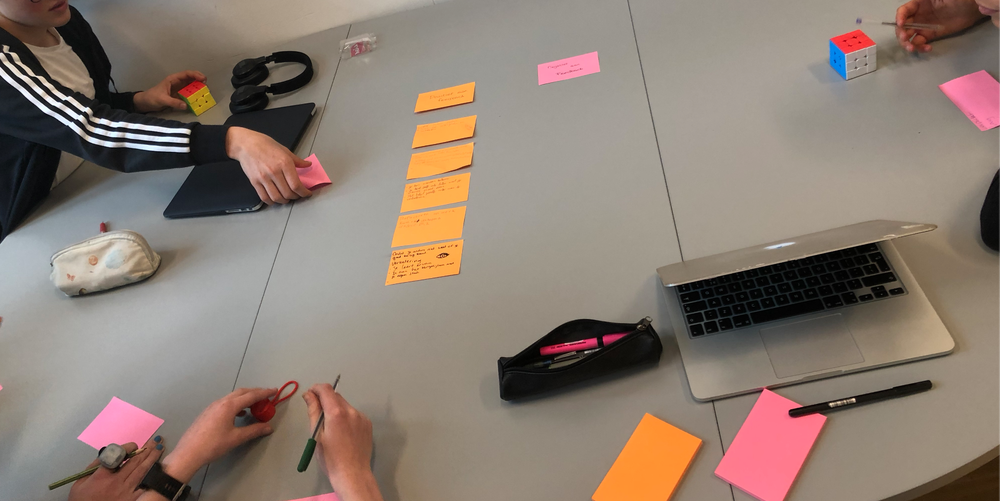
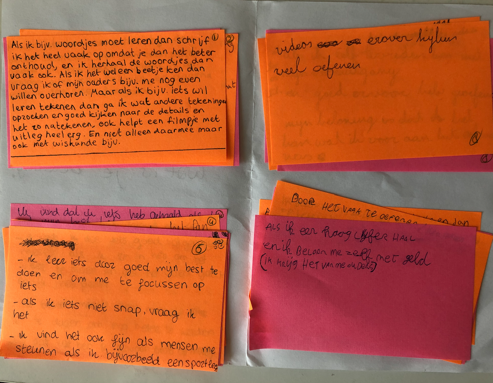

# Leerlingen Sessie post-it's

Nadat ik een enquête had afgelegd bij de leerlingen wilde ik op bepaalde punten dieper ingaan. Plus wilde ik aan een aantal leerlingen vragen wat zij als feedback zien. Ik was ook erg benieuwd waardoor het komt dat leerlingen bang zijn om anderen te kwetsen door feedback.   
Omdat het mij ook was opgevallen dat er  de enquête naar voren kwam dat leerlingen het wel belangrijk vinden om feedback te ontvangen maar te veel tijd vinden kosten om het een ander te geven en liever aandacht besteden aan hun eigen opdracht.  

* Leerlingen zijn soms **bang een ander te kwetsen** wanneer zij feedback geven, waardoor zij bang zijn om feedback te geven aan iemand. 
* Leerlingen vinden het te **veel tijd kosten** om een ander feedback te geven, omdat zij die **tijd liever besteden** **aan** het maken van hun **eigen opdracht.**
* Leerlingen geven vaak aan de hand van de **beoordelingsrubric** **feedback** en **vinden dit moeilijk** omdat zij de rubric niet altijd goed begrijpen. Het vertalen van wat er wordt gevraagd in de rubric, naar de opdracht. 
* Leerlingen vinden het soms lastig om feedback te ontvangen, omdat zij hard hun best hebben gedaan om de opdracht goed te maken en hebben er veel tijd in gestoken. Zij vinden het dan niet prettig  wanneer iemand hierop **“negatieve feedback/kritiek”** geeft. Dit **zien zij als belediging**. 
* Leerlingen geven aan dat zij feedback krijgen belangrijk vinden, omdat zij hiermee hun **opdracht kunnen verbeteren**.
* Leerlingen willen graag precies weten wat zij moeten verbeteren, anders vinden zij de feedback te vaag. 
* Vinden afvink lijstjes prettig.

## Post-its

