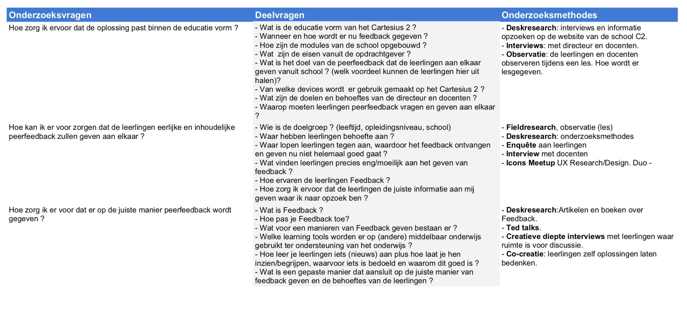

# Onderzoeksplan

## Wat wil ik weten en wat moet ik er voor doen?

Om de probleemstelling goed om te kunnen zetten naar een Design Challenge wil ik de volgende stappen nemen. 

* Het probleem goed in kaart brengen. Door met docenten in gesprek te gaan en leerlingen + algemene enquête af te leggen. Er heeft zich nog maar 1 gesprek plaatsgevonden. 
* Verdieping in de school. Wat voor soort school is het Cartesius 2 en welke educatie vorm passen zij toe? Wat de visie is van de school.
* Verdieping in directeur en docenten en behoeftes v.w.b. Feedback. Diepte interviews afleggen. Hoe gaan zij nu om met Feedback voor de leerlingen. Welke manieren worden er nu toegepast ? Wat zijn hun ervaringen hiermee.
* Verdieping in het onderwerp. Wat is Feedback ? Welke Vormen van Feedback bestaan er ? Hoe bouw je Feedback op ? Hoe pas je Feedback toe ?
* Verdiepen in de doelgroep. Wie is de doelgroep voor de oplossing? Wie zal er het meeste gebruik maken van de oplossing ?  Er achter komen waar leerlingen tegenaan lopen, of het voor hen een probleem is en waar dit aan ligt. Wat willen zij? Wat vinden zij moeilijk ? Waar hebben zij behoeftes aan ? etc. Door enquêtes af te leggen en door met een aantal leerlingen in gesprek te gaan. Plus wat hen ook zou kunnen helpen om dit op te kunnen lossen. 
* Wordt het een oplossing dat alleen ingezet zal worden door docenten en gebruikt zal worden door leerlingen? Of zal de oplossing ook gebruikt worden door de docenten ? 
* Van welke devices maken zij gebruik ?

Bron: [http://www.onderzoekspraktijk.net/nl/analyseren\_en\_valideren](http://www.onderzoekspraktijk.net/nl/analyseren_en_valideren)

## Waar moet ik nog meer rekening mee houden ?

* Vakanties - wanneer vallen deze ? Belangrijk voor mijn doelgroep onderzoek, docenten interviews en gebruikers testen etc. 
* Lessen en tijden.
* Aantal leerlingen om te testen en hoe te benaderen. 
* Vaste aanspreek punt/persoon op het C2 regelen. "Begeleider" 
* Leerlingen zijn minderjarig en moet ook rekening houden met hoe interviews houd met hen en hoe ik foto's en of video's ga maken gedurende mijn onderzoek. Gezien er veel gebeurt rondom privacy en vooral op scholen. 

